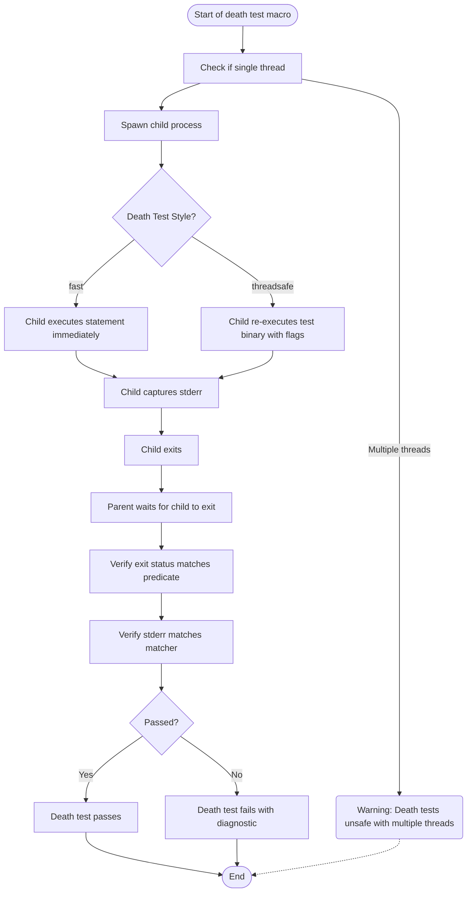

# Death Tests API

## Overview

The Death Tests API offers a powerful mechanism within GoogleTest to verify that specific pieces of code cause a process to terminate as expected. This is essential for testing assertions, safety checks, or other scenarios where program termination is the correct response to a failure or invalid state.

Rather than detecting ordinary test failures, death tests ensure that code exits (or aborts) in a controlled way, optionally matching the exit status and the error output. This documentation explains the usage, workflow, and diagnostics features of writing and controlling death tests.

---

## How Death Tests Work

GoogleTest runs death tests by forking or spawning a new process to execute the statement under test. It isolates the potentially terminating code so that the main test harness remains stable and can continue running further tests.

The key steps when a death test macro (`ASSERT_DEATH`, `EXPECT_DEATH`, `ASSERT_EXIT`, or `EXPECT_EXIT`) is encountered:

1. **Prepare Environment:** The parent process prepares to spawn an isolated child process.
2. **Spawn Child Process:** The child process is created. Its execution strategy depends on the death test style (explained below).
3. **Execute Statement:** The death test statement executes in the child process.
4. **Wait and Capture:** The parent waits for the child to terminate, capturing its exit status and `stderr` output.
5. **Verify Outcomes:** The parent verifies:
   - The process terminated (did not live or return).
   - The exit status matches the specified predicate (`ExitedWithCode`, `KilledBySignal`, or a custom predicate).
   - The `stderr` output matches the specified regular expression or matcher.

If any check fails, the death test captures detailed diagnostic messages.

---

## Writing Death Tests

There are two primary macros to write death tests:

- `EXPECT_DEATH(statement, matcher)`  
- `ASSERT_DEATH(statement, matcher)`

These verify that `statement` causes the program to exit with a nonzero exit status, and that the `stderr` output matches the given `matcher`. For more control over exit codes, use:

- `EXPECT_EXIT(statement, predicate, matcher)`  
- `ASSERT_EXIT(statement, predicate, matcher)`

### Basic Usage

```cpp
// Asserts that calling Foo() terminates the process with an error containing "Invalid parameter".
ASSERT_DEATH(Foo(), "Invalid parameter");

// Checks in a loop that processing each request causes process termination with expected error.
for (int i = 0; i < 5; i++) {
  EXPECT_DEATH(ProcessRequest(i), "Invalid request .* in ProcessRequest()") << "Failed at iteration " << i;
}

// Checks that ExitNow() exits with code 0 and prints "Exiting".
ASSERT_EXIT(ExitNow(), ::testing::ExitedWithCode(0), "Exiting");

// Custom predicate for signals not supported on Windows
bool KilledBySIGHUP(int code) {
  return WIFSIGNALED(code) && WTERMSIG(code) == SIGHUP;
}

ASSERT_EXIT(HangUpServer(), KilledBySIGHUP, "Hanging up!");
```

### Matcher and Predicate Parameters

- **Matchers:** The second parameter is either a bare string interpreted as a regex (Legacy support) or a matcher for `const std::string&`. For best practice, provide an explicit matcher (e.g., `ContainsRegex()`).
- **Predicates:** For `ASSERT_EXIT` and `EXPECT_EXIT`, the second parameter is a function or functor that accepts the child's integer exit status and returns `bool`, such as:
  - `ExitedWithCode(exit_code)` — verifies normal process exit with a specific code.
  - `KilledBySignal(signal_number)` — verifies termination by a signal (POSIX only).

---

## Death Test Styles

The `--gtest_death_test_style` flag controls how death tests spawn and execute the child process.

- **fast:** The child process is created by forking, then immediately executes the death test code. This is faster but less thread-safe.
- **threadsafe:** The child process is created by re-executing the entire test binary with flags to run only the specific death test. It provides better isolation in multithreaded environments but is slower.

Platforms:

- On Windows, death tests are always threadsafe.
- On POSIX systems, you can choose between `fast` and `threadsafe`.

Set the death test style programmatically or with a command-line flag:

```cpp
int main(int argc, char** argv) {
  ::testing::InitGoogleTest(&argc, argv);
  GTEST_FLAG_SET(death_test_style, "threadsafe");
  return RUN_ALL_TESTS();
}
```

---

## Important Considerations and Best Practices

### Process Isolation and Side Effects

- Death test statements run in a separate process; any side effects on program state are not visible to the parent or subsequent tests.
- Avoid freeing or modifying shared resources during death tests unless carefully managed.

### Thread Safety

- For safety, death tests require the test process to run with a single thread.
- GoogleTest emits a warning if multiple threads are detected when starting a death test.
- `threadsafe` style is recommended if your test binary spawns multiple threads before death tests run.

### Statement Restrictions

- Avoid placing return statements or exceptions inside the death test statement; these cause failure conditions.
- Some GoogleTest macros that abort the current function should be used carefully inside death test statements.

### Naming Conventions

- Test suites containing death tests should be named ending with `DeathTest` to prioritize their execution and for clarity.
- If sharing fixtures between normal and death tests, use type aliases (e.g., `using FooDeathTest = FooTest;`).

### Memory Leaks and Mocks

- When using mocks in death tests with specific exit codes, allow leaks by calling `Mock::AllowLeak` to prevent false leak detection failures.

---

## Common Macros and Classes

### Macros

| Macro                     | Behavior                                                                                 | Available When          |
|---------------------------|------------------------------------------------------------------------------------------|------------------------|
| `ASSERT_DEATH(stmt, regex)` | Asserts `stmt` causes death with nonzero exit and stderr matches `regex`. Aborts test.    | Platforms with death test support |
| `EXPECT_DEATH(stmt, regex)`  | Same as above but allows test to continue.                                         | Platforms with death test support |
| `ASSERT_EXIT(stmt, pred, regex)` | Asserts `stmt` causes exit matching `pred` and `regex`. Aborts test.            | Platforms with death test support |
| `EXPECT_EXIT(stmt, pred, regex)`  | Same as above but allows test to continue.                                         | Platforms with death test support |
| `EXPECT_DEBUG_DEATH(stmt, regex)` | Like `EXPECT_DEATH` in debug builds; runs `stmt` only in optimized builds.        | Platforms with death test support |
| `ASSERT_DEBUG_DEATH(stmt, regex)` | Like `ASSERT_DEATH` in debug builds; runs `stmt` only in optimized builds.        | Platforms with death test support |
| `EXPECT_DEATH_IF_SUPPORTED(stmt, regex)` | Runs `EXPECT_DEATH` if death tests are available; otherwise emits warning without failing.| All platforms, no-op on unsupported |
| `ASSERT_DEATH_IF_SUPPORTED(stmt, regex)` | Runs `ASSERT_DEATH` if death tests are available; otherwise emits warning without failing.| All platforms, no-op on unsupported |

### Predicate Classes

- `ExitedWithCode(int exit_code)`: Checks if process exited normally with specified code.
- `KilledBySignal(int signum)`: Checks if process was terminated by a specific signal (non-Windows).

---

## Writing Effective Death Tests

### Step-by-step

1. **Write Test Suite and Test Case:** Prefer naming test suites ending with `DeathTest`.
2. **Use Death Test Macros:** Use `ASSERT_DEATH` or `EXPECT_DEATH` with a statement expected to terminate.
3. **Provide a Matcher:** Write a regex or matcher to verify the error output.
4. **Run and Observe:** Execute your tests; if the tested code fails to exit or the output does not match, the test fails.

Example:

```cpp
TEST(DatabaseDeathTest, FailsOnNullPointer) {
  ASSERT_DEATH(Database::Connect(nullptr), "Null connection string");
}

for (int i = 0; i < 3; ++i) {
  EXPECT_DEATH(ProcessInput(i), "Invalid input detected") << "Iteration " << i;
}
```

### Diagnosing Failures

- If the test says "failed to die," the statement did not terminate the process.
- If the exit code differs from expected, verify the predicate used in `ASSERT_EXIT` or `EXPECT_EXIT`.
- If the error output doesn't match, refine your matcher or use matchers like `ContainsRegex`.
- Check for illegal return statements or exceptions thrown inside death test statement, which cause failures.

### Tips

- When writing regexes for error message matching, keep compatibility with the supported regex subset (no unions, groups, or counts).
- Avoid side effects in death test statements as they run in a separate process.
- Use `SCOPED_TRACE` in loops to help identify which iteration fails within death tests.

---

## Troubleshooting Common Issues

### Multiple Threads Warning

Death tests use `fork()` on POSIX, which is unsafe with multiple threads. If your test emits a warning about multiple threads:

- Prefer to run the death test in `threadsafe` mode.
- Manage thread lifetimes to ensure only one thread is active during the death test.

### Death Test Not Firing

If the death test fails because the test code does not terminate:

- Verify that the statement actually terminates with `_Exit()`, `exit()`, `abort()`, or a fatal signal.
- Check the death test style and platform compatibility.

### Unexpected Return or Exception Failures

- Death test statements must not `return` explicitly or throw exceptions; either leads to failure.
- Avoid using `ASSERT_*` macros inside death test statements as they may cause unintended returns.

### Unsupported Platforms

On systems where death tests are not supported, `EXPECT_DEATH_IF_SUPPORTED` and `ASSERT_DEATH_IF_SUPPORTED` will issue warnings but not fail.

---

## Internal Utilities and Flags

- `--gtest_death_test_style=threadsafe|fast`: Controls death test execution style.
- `--gtest_internal_run_death_test`: Internal flag passed to child during threadsafe death tests.
- `GTEST_FLAG_SET(death_test_style, value)`: Programmatic API for setting death test style.

These are primarily for internal and advanced usage but can be leveraged to control death test behaviour in test suites.

---

## Related Concepts

- See [Death Assertions](../reference/assertions.md#death) for macro specifics and matcher syntaxes.
- For advanced usage on catching thrown exceptions in death tests, consult the [Testing Death and Exception Cases guide](/guides/advanced-patterns/testing-death-and-exception-cases).
- Understand threading implications in the [Death Tests And Threads section of the Advanced documentation](/docs/advanced.md#death-tests-and-threads).
- For matching error messages, explore [Matchers Reference](../api-reference/matchers-actions/core-matchers.md).

---

## Example: Basic Death Test

```cpp
// Checks that calling abort terminates with message "aborted".
TEST(MyDeathTest, AbortsWithMessage) {
  EXPECT_DEATH(abort(), "aborted");
}

// Checks that a function named DieIf() terminates when passed true.
TEST(MyDeathTest, DieIfTrue) {
  EXPECT_DEATH(DieIf(true), "DieIf\(\)");
}

// Using detailed predicate to check exit code.
TEST(MyDeathTest, NormalExit) {
  EXPECT_EXIT(NormalExit(), testing::ExitedWithCode(0), "Success");
}
```

---

## Summary Diagram of Death Test Workflow



---

## Additional Notes

- The DeathTest class abstracts the death test lifecycle, handling child process spawning, waiting, and result interpretation.
- The implementation supports multiple platforms, including Windows, Linux, Mac, Fuchsia, and QNX, adapting process creation accordingly.
- Internal flags and helpers ensure isolation and reporting between parent and child processes.

---

## References

- See [Assertions Reference - Death Assertions](../reference/assertions.md#death) for macro usage details.
- Review [Advanced GoogleTest Topics](../docs/advanced.md#death-tests) for deeper insights on death testing.
- Consult [Getting Started With GoogleTest Primer](../guides/getting-started/primer-essential-features) to understand foundational test writing.

---

<Callout title="Tip">
To avoid flaky or unsafe death tests, always select the `threadsafe` death test style if your test code or environment uses multiple threads.
</Callout>

<Callout title="Warning">
Never use statements that throw exceptions or return inside death test macros; doing so will cause your test to fail unexpectedly.
</Callout>

---

### Source

<Source url="https://github.com/google/googletest" branch="main" paths={[{"path": "googletest/include/gtest/gtest-death-test.h", "range": "1-240"},{"path": "googletest/src/gtest-death-test.cc", "range": "1-500"},{"path": "googletest/test/googletest-death-test-test.cc", "range": "1-490"}]} />
