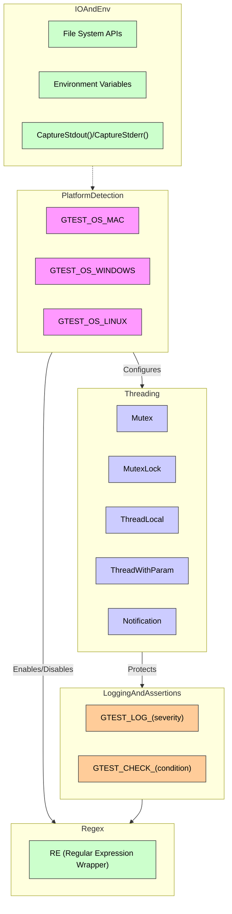

# Portability & Internal Utilities

GoogleTest provides a robust suite of internal APIs and utilities designed to facilitate seamless operation across diverse platforms and environments. These APIs primarily address cross-platform compatibility, threading abstractions, platform detection, synchronization primitives, and system-level utilities. This documentation focuses specifically on these portability and internal utility APIs, catering to contributors and advanced users aiming to integrate or extend GoogleTest/GoogleMock in heterogeneous environments.

---

## Overview

Portability & Internal Utilities are the foundational building blocks that enable GoogleTest and GoogleMock to support multiple operating systems, compilers, and runtime environments with consistent behavior. This includes:

- Detecting operating systems and platform features at compile-time.
- Providing abstractions for threading, synchronization, and thread-local storage.
- Offering utilities such as logging, capturing standard I/O streams, and command-line/environment variable parsing.
- Supporting internal regular expression implementations with platform-specific adaptations.

By encapsulating platform differences, these utilities allow GoogleTest to maintain a stable and consistent API layer for user tests and internal features alike.

---

## Platform Detection

GoogleTest automatically detects the compilation platform using compile-time macros and sets platform-specific flags that influence internal implementations and feature availability.

### Platform Macros

- Macros beginning with `GTEST_OS_*` indicate the target OS or environment.
- Examples include `GTEST_OS_WINDOWS`, `GTEST_OS_LINUX`, `GTEST_OS_MAC`, `GTEST_OS_CYGWIN`, `GTEST_OS_FUCHSIA`, and many others.
- More granular variants exist for platform subtypes, e.g., `GTEST_OS_WINDOWS_DESKTOP`, `GTEST_OS_WINDOWS_MINGW`, and `GTEST_OS_IOS`.

<Note>
Users typically do not need to manually adjust these macros, as detection is automatic. However, custom build environments may override or define them for special cases.
</Note>

---

## Environment Feature Macros

Feature availability macros define support for crucial capabilities and allow conditional compilation:

- `GTEST_HAS_PTHREAD`: Indicates presence of POSIX threads.
- `GTEST_HAS_EXCEPTIONS`: Exception support enabled.
- `GTEST_HAS_DEATH_TEST`: Death test support present.
- `GTEST_HAS_STREAM_REDIRECTION`: Ability to redirect stdout/stderr streams.
- `GTEST_HAS_STD_WSTRING`: Availability of `std::wstring`.
- `GTEST_HAS_RTTI`: Runtime Type Information availability.

These macros enable GoogleTest to adapt functionality and fallback gracefully on feature-limited platforms.

---

## Synchronization Primitives

Cross-platform synchronization types provide thread safety when GoogleTest is built with threadsupport.

### `Mutex`

- Wraps native mutex mechanisms (Windows Critical Sections, POSIX pthread mutexes).
- Provides `lock()`, `unlock()`, and `AssertHeld()` for checking ownership.
- Supports static and dynamic initialization via macros:
  - `GTEST_DECLARE_STATIC_MUTEX_(mutex)` to declare.
  - `GTEST_DEFINE_STATIC_MUTEX_(mutex)` to define.

### `MutexLock`

- A RAII-style scoped lock that locks a given `Mutex` upon construction and unlocks on destruction.
- Prevents deadlocks and ensures safe mutex release.

### `ThreadLocal<T>`

- Provides thread-local storage for type T.
- Two constructors: default value constructor and explicit initial value constructor.
- Methods include `get()`, `pointer()`, and `set(value)`.
- Internally implemented with Windows TLS APIs, POSIX pthread keys, or fallback no-op for non-threadsafe builds.

<Info>
The use of `ThreadLocal` ensures that thread-specific data is isolated without user intervention, crucial for concurrent test executions.
</Info>

---

## Threading Support Utilities

GoogleTest contains helper classes to manage threads in a platform-independent way, useful mostly internally but also for advanced contributors.

### `ThreadWithParam<T>`

- Template class that wraps creation and joining of threads executing a function with parameter `T`.
- Provides synchronization mechanisms to delay thread start until explicitly notified (`Notification`).
- Facilitates safe multi-threaded test scenarios by abstracting native thread handles.

### `Notification`

- Allows coordination between threads by enabling one thread to signal others to start.
- Used internally to control test thread lifecycle and ensure proper sequencing.

<Warning>
These threading utilities are internal and should not be used directly in user tests.
</Warning>

---

## Logging and Assertion Utilities

GoogleTest provides macros and classes to support robust logging, especially for internal checks and fatal failures.

### `GTEST_LOG_(severity)`

- Logs messages with levels: `INFO`, `WARNING`, `ERROR`, `FATAL`.
- `FATAL` messages abort the test execution immediately.

### `GTEST_CHECK_(condition)`

- An assert-like macro that validates a condition, logs on failure, and aborts immediately.
- Used internally to catch programming errors and platform API call failures.

### `GTEST_CHECK_POSIX_SUCCESS_(posix_call)`

- Specialized check for POSIX calls returning `0` on success.
- Logs the call with error code on failure and aborts.

<Check>
Use these macros to ensure that critical assumptions hold especially around platform calls and threading.
</Check>

---

## Stream Capturing Utilities

For testing output capture behaviors, the following APIs enable interception of stdout and stderr streams:

- `CaptureStdout()` and `GetCapturedStdout()` capture standard output.
- `CaptureStderr()` and `GetCapturedStderr()` capture standard error.
- These are essential for death tests and verifying output messages.

<Tip>
Only one capture at a time is supported; attempting to nest captures will trigger a fatal error.
</Tip>

---

## Internal Regular Expression (`RE`) Class

GoogleTest provides an internal wrapper `RE` for regular expressions to unify implementation across platforms:

- Uses Abseil's RE2 engine if available.
- Falls back to POSIX regex on supported platforms.
- A simplified regex engine on other platforms.

This class exposes handy APIs:

- Constructors from `std::string` or `const char*`.
- `FullMatch(str, re)` to match entire string.
- `PartialMatch(str, re)` for substring matches.

<Note>
`RE` is primarily used internally for death test regex matching, but can be referenced by advanced users for compatibility reasons.
</Note>

---

## File System and Environment Utilities

GoogleTest hides platform differences behind wrappers for certain file system and environment operations:

### File System

- `FileNo(FILE* file)` returns the underlying file descriptor.
- `Stat`, `RmDir`, and `IsDir` provide file/directory status abstraction.
- `FOpen`, `FReopen`, `FDOpen`, and `FClose` wrap file opening and closing.

### Environment Variables

- `GetEnv(const char* name)` retrieves environment variables across platforms.
- On embedded or limited platforms, environment variables may be unavailable and this returns `nullptr`.

---

## Command Line and Flags

GoogleTest integrates with Abseil flags if available, otherwise exposes its own flag macros for compatibility.

- Flags can be declared and defined via macros like `GTEST_DEFINE_bool_`, `GTEST_DECLARE_int32_`, etc.
- Macros `GTEST_FLAG_GET(name)` and `GTEST_FLAG_SET(name, value)` provide flag accessors.

This system underpins GoogleTest command-line flags such as `gtest_filter`, `gtest_repeat`, and others.

---

## Practical Tips & Best Practices

- When extending GoogleTest or integrating it into custom platforms, first verify platform detection macros to avoid misconfiguration.
- Use the synchronization primitives (`Mutex`, `MutexLock`, `ThreadLocal`) when adding multi-threaded tests or thread-safe code.
- Leverage logging macros `GTEST_LOG_` and assert macros `GTEST_CHECK_` for internal invariant enforcement.
- Avoid nesting stream capture calls due to global state limitations.
- Choose the appropriate regular expression API for pattern matching, relying on `RE` for consistent behavior.

---

## Troubleshooting

### Threads Not Synchronizing Correctly

- Confirm `Notification` objects are used correctly to coordinate thread start.
- Ensure `Mutex` locking matches unlocking, and avoid deadlocks by careful lock ordering.

### CaptureStdout/CaptureStderr Fails

- Check that no other capture is active before starting a new one.
- Platform limitations might disable capture features (e.g., mobile platforms).

### Platform Detection Is Incorrect

- Override detection macros with build flags if the environment reports incorrectly.
- Consult the `gtest-port-arch.h` source header to confirm recognized platforms.

---

## Example: Using ThreadLocal

```cpp
// Declare a thread-local integer with default value 0
::testing::internal::ThreadLocal<int> tls_int;

void ThreadFunc() {
  // Each thread gets its own copy with default value
  int val = tls_int.get();
  tls_int.set(val + 1);
}

// In your test setup...
std::thread t1(ThreadFunc);
t1.join();
```

This enables tests to safely manipulate thread-specific state without clashes.

---

## Architecture Diagram: Portability & Internal Utilities



This high-level view highlights the interdependencies and modular layering in GoogleTest's portability framework.

---

## References

- [Platform Detection Macros](googletest/include/gtest/internal/gtest-port-arch.h)
- [Threading and Synchronization Utilities](googletest/include/gtest/internal/gtest-port.h)
- [Logging and Assertions](googletest/include/gtest/internal/gtest-port.h)
- [Regular Expressions Internals](googletest/include/gtest/internal/gtest-port.h)
- [Stream Capture Tests](googletest/test/googletest-port-test.cc)
- Related Guides: [Supported Platforms & Build Tools](overview/integration-and-ecosystem/supported-platforms-build-tools.md), [System Requirements](getting-started/prerequisites-and-installation/system-requirements.md)

---

This page works in concert with the larger API Reference and Advanced Internals documentation, providing a solid foundation for advanced customizations, cross-platform support, and robust testing workflows.
