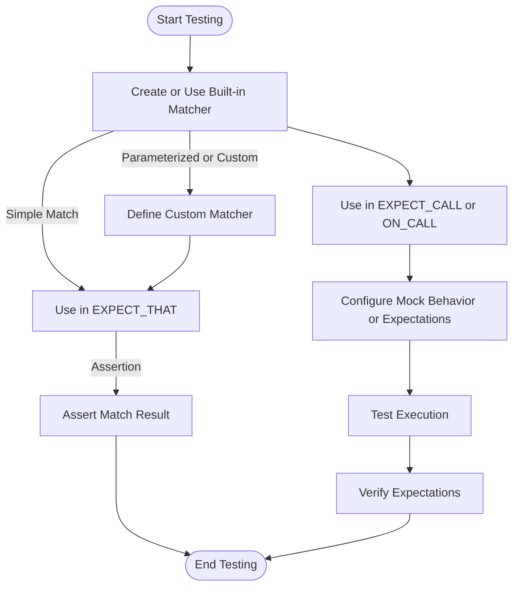

# Core and Custom Matchers

Explore the comprehensive suite of built-in matcher interfaces in GoogleTest and GoogleMock, learn how to combine and customize matchers, and master the art of crafting readable and maintainable test expectations. This page guides you through leveraging both GoogleTest and GoogleMock matcher APIs to write expressive assertions and mock method expectations that precisely capture your testing intent.

---

## Introduction

Matchers are the keystones of expressive and flexible testing in GoogleTest and GoogleMock. They provide declarative ways to specify properties that test values or mock function arguments must satisfy. This page covers core matchers, combining matchers to form compound expectations, creating custom matchers tailored to your domain, and practical guidance for writing clear, maintainable test code. Support is provided for both GoogleTest and GoogleMock matcher APIs, allowing seamless integration in assertions and mock setups.

---

## Built-in Core Matchers

GoogleTest and GoogleMock offer a rich set of polymorphic matchers that can be used to match many C++ types with clean, readable syntax.

### Wildcard Matchers
- `_`  — Matches any value of the correct type.
- `A<T>()`, `An<T>()` — Matches any value of type `T`.

### Generic Comparison Matchers
- `Eq(value)` or `value` — Matches argument equal to `value`.
- `Ne(value)` — Not equal to `value`.
- `Lt(value)`, `Le(value)`, `Gt(value)`, `Ge(value)` — Less than, less or equal, greater than, or greater or equal to `value`.
- `IsTrue()`, `IsFalse()` — Boolean truths.
- `IsNull()`, `NotNull()` — Matches NULL or non-null pointers (raw or smart).
- `Optional(m)` — Matches an `optional` engaged with value matching `m`.
- `Ref(variable)` — Matches a reference to a specific variable.
- `TypedEq<T>(value)` — Typed equality useful for overload resolution.

### String Matchers
- `StrEq(s)`, `StrNe(s)` — Case-sensitive equality and inequality.
- `StrCaseEq(s)`, `StrCaseNe(s)` — Case-insensitive equality and inequality.
- `HasSubstr(s)` — Matches if value contains substring `s`.
- `StartsWith(prefix)` — Matches values starting with `prefix`.
- `EndsWith(suffix)` — Matches values ending with `suffix`.
- `MatchesRegex(regex)`, `ContainsRegex(regex)` — Regex full match and partial match.
- `WhenBase64Unescaped(m)` — Matches base64 encoded string which, when decoded, matches matcher `m`.

### Container Matchers
- `IsEmpty()` — Matches empty containers or strings.
- `Contains(e)` — Container has at least one element matching `e`.
- `Each(e)` — All elements match `e`.
- `ElementsAre(...)`, `ElementsAreArray(...)` — Expected sequence of elements.
- `UnorderedElementsAre(...)` — Matches any permutation.
- `SizeIs(m)` — Matches container of size matching `m`.
- `Pointwise(pair_matcher, container)` — Element-wise combined match.

### Member and Pointer Matchers
- `Field(&Class::field, m)` — Matches objects whose field matches `m`.
- `Property(&Class::property, m)` — Matches objects whose getter method returns a value matching `m`.
- `Key(m)` — Matches `std::pair` with first element matching `m`.
- `Pair(m1, m2)` — Matches `std::pair` with first and second element matching respectively.
- `Pointee(m)` — Matches pointer/smart pointer pointing to a value matching `m`.
- `Pointer(m)` — Matches a pointer value matching matcher `m`.
- `Address(m)` — Matches objects whose address matches `m`.
- `WhenDynamicCastTo<T>(m)` — Matches if providing dynamic_cast to `T` yields value matching `m`.

### Exception Matchers (GoogleTest with exceptions enabled)
- `Throws<E>()` — Matches callable that throws exception of type `E`.
- `Throws<E>(m)` — Callable throws type `E` that matches `m`.
- `ThrowsMessage<E>(m)` — Callable throws type `E` with `.what()` matching `m`.

---

## Combining Matchers

Matchers can be combined logically to express more intricate constraints:

- `AllOf(m1, m2, ..., mn)` — Matches if *all* matchers `m1...mn` match.
- `AnyOf(m1, m2, ..., mn)` — Matches if *any* matcher `m1...mn` matches.
- `Not(m)` — Matches if matcher `m` does *not* match.
- `Conditional(cond, m1, m2)` — Matches using `m1` if `cond` is true else `m2`.

Use these combinators to write complex conditions clearly and concisely.

---

## Specialized Matchers

### Numerical and Floating Point
Use:
- `DoubleEq(value)` and `FloatEq(value)` — For approximate equality of floating types, respecting IEEE nan behaviors.
- `DoubleNear(value, tolerance)` / `FloatNear(value, tolerance)` — Match within absolute error bounds.

### Container Specific
- `ContainerEq(c)` — Equality with detailed mismatch reporting of containers acting as sets.
- `IsSubsetOf(c)`, `IsSupersetOf(c)` — Matches containers that are subset or superset respectively.
- `UnorderedElementsAre(...)` — Matches container elements in any order but exact set.

---

## Creating Custom Matchers

Sometimes, built-in matchers cannot express the property you want to assert. GoogleMock offers powerful ways to create your own matchers that integrate seamlessly:

### Using MATCHER Macros
- `MATCHER(name, description)` defines a matcher with a callable body using `arg`.
- `MATCHER_P(name, param, description)` defines a parameterized matcher taking one parameter.
- Variants `MATCHER_P2`, ..., `MATCHER_P10` provide multiple parameters.

Inside the matcher body, you return `bool` indicating match success. Use `*result_listener` to stream explanatory messages.

**Example:** Define a matcher that checks if a number is divisible by 7:
```cpp
MATCHER(IsDivisibleBy7, "") { return (arg % 7) == 0; }
```
Use it as:
```cpp
EXPECT_THAT(value, IsDivisibleBy7());
```

### Implementing MatcherInterface

For advanced control, implement `MatcherInterface<T>`, providing:
- `bool MatchAndExplain(const T&, MatchResultListener*)` — match logic with optional explanation.
- `void DescribeTo(std::ostream*)` — description on success.
- `void DescribeNegationTo(std::ostream*)` — description on failure.

Wrap and expose it as a `Matcher<T>` via a factory function.

### Polymorphic Matchers

Implement matchers that can match multiple types by making `MatchAndExplain` a template. Use `MakePolymorphicMatcher()` to create the polymorphic matcher.

---

## Casting Matchers

To adapt matcher types to expected argument types, use:

- `MatcherCast<T>(m)` — Cast matcher `m` to accept `T`. Unsafe casts can compile but may lead to issues.
- `SafeMatcherCast<T>(m)` — Like `MatcherCast` but performs compile-time checks to ensure safety.

These functions enable flexible matcher reuse when the argument types differ but are compatible.

---

## Using Matchers in Assertions and Mock Expectations

GoogleTest and GoogleMock provide the following idiomatic ways to use matchers:

- `EXPECT_THAT(value, matcher)` — Assert the given value matches.
- `ASSERT_THAT(value, matcher)` — Like EXPECT_THAT but halts on failure.
- `EXPECT_CALL(mock, Method(matcher1, matcher2, ...))` — Set expectations on mock methods using matchers.
- `ON_CALL(mock, Method(matcher1, matcher2, ...))` — Define default behavior with matchers.

Match arguments exactly, partially with wildcards, or with complex compositions.

---

## Best Practices for Readable and Maintainable Matchers

- **Use expressive matchers for clarity**: Prefer named and reusable matchers over inline lambdas or ad-hoc code.
- **Combine simpler matchers**: Instead of one complicated matcher, use `AllOf()` or `AnyOf()` with small matchers.
- **Stream explanations**: When writing custom matchers, provide helpful failure explanations using `result_listener`.
- **Be mindful of side-effects**: Matchers must be pure functions without observable side effects.
- **Prefer `SafeMatcherCast` over `MatcherCast`** for type conversion safety.
- **Name your custom matchers clearly**, reflecting their intent.

---

## Practical Examples

### Using Built-in Matchers
```cpp
using ::testing::_;              // Wildcard
using ::testing::Gt;             // Greater than
using ::testing::HasSubstr;      // Substring
using ::testing::ElementsAre;    // Sequence matching

EXPECT_THAT(42, Gt(30));
EXPECT_THAT("hello world", HasSubstr("world"));
EXPECT_THAT(std::vector<int>{1, 2, 3}, ElementsAre(1, _, 3));
```

### Writing a Custom Matcher with MATCHER_P
```cpp
MATCHER_P(IsDivisibleBy, divisor, "") {
  if ((arg % divisor) == 0) return true;
  *result_listener << "which leaves a remainder " << (arg % divisor);
  return false;
}

EXPECT_THAT(21, IsDivisibleBy(7));  // Passes
EXPECT_THAT(22, IsDivisibleBy(7));  // Fails with explanation.
```

### Combining Matchers
```cpp
EXPECT_THAT(value, AllOf(Gt(10), Lt(20)));  // Matches value in (10, 20)
EXPECT_THAT(ptr, AnyOf(IsNull(), Eq(special_pointer)));
```

### Casting Matcher Types to Match Arguments
```cpp
Matcher<long> m_long = Gt(5);
Matcher<int> m_int = SafeMatcherCast<int>(m_long);
EXPECT_TRUE(m_int.Matches(6));
```

---

## Troubleshooting Common Issues

- **Matcher not matching expected type**: Use `SafeMatcherCast` to convert matcher types.
- **Unintentional implicit conversions**: Prefer explicit `Eq(value)` instead of relying on implicit conversion.
- **Matcher descriptions unclear or missing**: Provide custom description strings or stream explanations inside the matcher body.
- **Performance considerations**: Compose complex matchers efficiently and avoid costly constructions in tight loops.

---

## Learn More

For deeper understanding and recipes on custom matchers and actions, consult:

- [gMock Cookbook](https://google.github.io/googletest/gmock_cook_book.html) — Practical recipes for mocking and matchers.
- [Matchers Reference](https://google.github.io/googletest/reference/matchers.html) — Complete list of built-in matchers.
- [Writing New Matchers Quickly](https://google.github.io/googletest/gmock_cook_book.html#NewMatchers) — Guide on creating your own matchers.
- [Assertions Reference](https://google.github.io/googletest/reference/assertions.html#EXPECT_THAT) — Using matchers in assertions.
- [Mocking Reference](https://google.github.io/googletest/reference/mocking.html) — Comprehensive mock class and method usage.

---

This page is part of the [Matchers, Actions, and Mocking API section](../../index.html#MatchersActionsMockingAPI) in the API Reference.


---

<Callouts>
<Note>
GoogleMock lives in the ::testing namespace. For readability, do `using ::testing::Foo;` before usage.
</Note>
<Tip>
When composing matchers, assign named variables to complex matcher expressions for reuse and clarity.
</Tip>
<Warning>
Remember that matchers must be purely functional: no side effects and consistent results.
</Warning>
</Callouts>

---

## Summary Diagram: Matcher Usage Flow



---