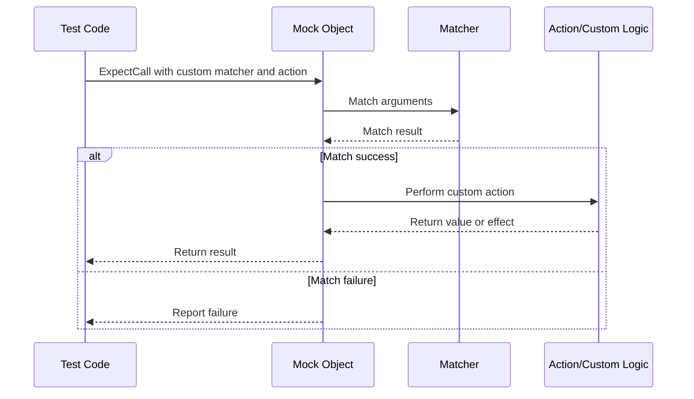

# Custom Actions and User-Defined Assertions

Extend GoogleTest and GoogleMock by defining custom actions, user-defined matchers, and new assertions. This guide empowers you to integrate your own logic into the testing workflow, covering complex scenarios and domain-specific testing needs.

---

## Why Extend GoogleTest and GoogleMock?
GoogleTest and GoogleMock come packed with a rich set of built-in matchers and actions suitable for most testing situations. However, your project may require specialized behaviors, custom validation logic, or actions that perform side effects beyond standard expectations.

Extending the framework allows you to:

- Implement domain-specific assertions that offer clearer failure diagnostics.
- Create custom mock method actions that execute complex logic or interact with external components.
- Enhance test expressiveness and maintainability by encapsulating common test patterns.

By writing custom extensions, you tailor the testing framework to your needs without compromising readability or robustness.

---

## Writing Custom Actions

Actions define what a mock function does when invoked. While GoogleMock provides many built-in actions, creating your own lets you describe precise mock behaviors.

### Simple Custom Actions Using Callables
For most cases, you can create custom actions simply by passing a callable (function, functor, or lambda) to `WillOnce()` or `WillRepeatedly()`:

```cpp
EXPECT_CALL(mock_obj, Method(_))
    .WillOnce([](int arg) { return arg * 2; });
```

This approach provides great flexibility and ease of use.

### Defining Named Actions with Macros
For reusable actions, define them using the `ACTION` macros. These macros create named actions that can be invoked more clearly:

```cpp
ACTION(DoubleArg) { return arg0 * 2; }

// Usage
EXPECT_CALL(mock_obj, Method(_)).WillOnce(DoubleArg());
```

Parameterized forms allow actions to accept configuration parameters:

```cpp
ACTION_P(Add, x) { return arg0 + x; }

// Usage
EXPECT_CALL(mock_obj, Method(_)).WillOnce(Add(10));
```

### Using `ACTION_TEMPLATE` for More Complex Actions
If you need additional template parameters or more complex signatures, use `ACTION_TEMPLATE`:

```cpp
ACTION_TEMPLATE(Repeat,
                HAS_1_TEMPLATE_PARAMS(int, N),
                AND_0_VALUE_PARAMS()) {
  for (int i = 0; i < N; ++i) {
    /* Perform some repeated operation */
  }
  return arg0;
}

// Usage
EXPECT_CALL(mock_obj, Method(_)).WillOnce(Repeat<3>());
```

### Implementing New Actions via Interfaces
For maximum control, implement the `ActionInterface<F>` interface, where `F` is the signature of the mocked function:

```cpp
class MyAction : public ::testing::ActionInterface<int(int)> {
 public:
  int Perform(const std::tuple<int>& args) override {
    int x = std::get<0>(args);
    return x * 42;
  }
};

::testing::Action<int(int)> MakeMyAction() {
  return ::testing::MakeAction(new MyAction);
}

// Usage
EXPECT_CALL(mock_obj, Method(_)).WillOnce(MakeMyAction());
```

### Polymorphic Actions
If you want your action to be usable with multiple function signatures, use polymorphic actions:

```cpp
class ReturnSecondArgAction {
 public:
  template <typename Result, typename ArgumentTuple>
  Result Perform(const ArgumentTuple& args) const {
    return std::get<1>(args);
  }
};

::testing::PolymorphicAction<ReturnSecondArgAction> ReturnSecondArg() {
  return ::testing::MakePolymorphicAction(ReturnSecondArgAction());
}

// Usage
EXPECT_CALL(mock_obj, Func(_, _)).WillOnce(ReturnSecondArg());
```

---

## Creating Custom Matchers

Matchers are central to expressive and maintainable assertions in GoogleTest and GoogleMock. While many matchers come built-in, you can craft your own to check complex conditions.

### Quick Creation with `MATCHER`
Use the `MATCHER` macro for simple, reusable matchers:

```cpp
MATCHER(IsEven, "checks if a number is even") {
  return (arg % 2) == 0;
}

// Usage
EXPECT_CALL(mock_obj, Method(IsEven()));
EXPECT_THAT(value, IsEven());
```

You can provide detailed failure explanations by streaming messages:

```cpp
MATCHER(HasNonZeroRemainder, "checks remainder is non-zero") {
  if ((arg % 3) != 0) {
    *result_listener << "which has remainder " << (arg % 3);
    return true;
  }
  return false;
}
```

### Parameterized Matchers with `MATCHER_P`
Define matchers with parameters for flexible checks:

```cpp
MATCHER_P(InRange, range, "checks if value in range") {
  return arg >= range.first && arg <= range.second;
}

// Usage
EXPECT_THAT(value, InRange(std::make_pair(5, 10)));
```

You can add multiple parameters with `MATCHER_P2`, `MATCHER_P3`, and so on.

### Writing Matcher Classes for Advanced Control
If you need full control or want to optimize error messages, implement the matcher interface:

```cpp
class DivisorMatcher {
 public:
  using is_gtest_matcher = void;
  explicit DivisorMatcher(int divisor) : divisor_(divisor) {}

  bool MatchAndExplain(int n, std::ostream* os) const {
    if (n % divisor_ != 0 && os != nullptr) {
      *os << "which leaves remainder " << (n % divisor_);
      return false;
    }
    return true;
  }

  void DescribeTo(std::ostream* os) const {
    *os << "is divisible by " << divisor_;
  }

  void DescribeNegationTo(std::ostream* os) const {
    *os << "is not divisible by " << divisor_;
  }

 private:
  int divisor_;
};

::testing::Matcher<int> DivisibleBy(int divisor) {
  return ::testing::MakeMatcher(new DivisorMatcher(divisor));
}

// Usage
EXPECT_THAT(value, DivisibleBy(7));
```

### Polymorphic Matchers
Create matchers usable for multiple types:

```cpp
class NotNullMatcher {
 public:
  using is_gtest_matcher = void;

  template <typename T>
  bool MatchAndExplain(T* ptr, std::ostream*) const {
    return ptr != nullptr;
  }

  void DescribeTo(std::ostream* os) const { *os << "is not null"; }
  void DescribeNegationTo(std::ostream* os) const { *os << "is null"; }
};

inline ::testing::PolymorphicMatcher<NotNullMatcher> NotNull() {
  return ::testing::MakePolymorphicMatcher(NotNullMatcher());
}

// Usage
EXPECT_CALL(mock_obj, Method(NotNull()));
```

---

## Defining Custom Assertions

For custom checking logic beyond simple matchers, GoogleTest allows user-defined assertions based on predicate-formatters returning `testing::AssertionResult`.

### Predicate-Formatter Functions

A predicate-formatter has the signature:

```cpp
testing::AssertionResult MyPredicateFormatter(const char* expr1, const char* expr2, Type1 val1, Type2 val2);
```

It returns `testing::AssertionSuccess()` on pass or `testing::AssertionFailure()` with message on fail.

Example:

```cpp
#include <gtest/gtest.h>

// Asserts that two integers are mutually prime.
testing::AssertionResult AssertMutuallyPrime(
    const char* expr_m, const char* expr_n, int m, int n) {
  if (std::gcd(m, n) == 1) return testing::AssertionSuccess();

  return testing::AssertionFailure() << expr_m << " and " << expr_n
     << " are not mutually prime (common divisor exists)";
}

// Usage
EXPECT_PRED_FORMAT2(AssertMutuallyPrime, a, b);
```

### Using Custom Assertions

Invoke them using the macros `EXPECT_PRED_FORMATn` or `ASSERT_PRED_FORMATn` inside your tests.

---

## Practical Tips and Best Practices

- **Reuse Extensively:** Define commonly used actions and matchers once and share them across your test suite.
- **Avoid Side Effects:** Custom matchers should be pure and free of side effects to prevent flaky tests.
- **Use `RetiresOnSaturation()` for Sticky Expectations:** When defining multiple actions for the same expectation, make sure to retire saturated ones to avoid upper bound violations.
- **Combine Actions with `DoAll()`:** When you need to execute multiple side effects in an action, chain them using `DoAll()`.
- **Capture Complex Arguments with `SaveArg()`:** To perform external checks on input parameters, save them from mock calls using provided helpers.

---

## Troubleshooting

- **Evaluation Occurs Once:** Remember that expressions inside `WillOnce(Return(expr))` or similar are evaluated _once_ at expectation setup, not on each call. Use lambdas or custom actions to defer evaluation.
- **Compatibility with Move-Only Types:** Some built-in actions do not support move-only types (e.g., `std::unique_ptr`). Use lambdas or custom actions to handle those.
- **Verbose Logging:** Use `--gmock_verbose=info` to trace mock calls and actions for debugging complex matching issues.

---

## References & Further Reading

- [gMock Cookbook: Writing New Matchers Quickly](https://google.github.io/googletest/gmock_cook_book.html#NewMatchers)
- [Actions Reference](https://google.github.io/googletest/reference/actions.html)
- [Mocking Reference](https://google.github.io/googletest/reference/mocking.html)
- [Matchers Reference](https://google.github.io/googletest/reference/matchers.html)
- [gMock for Dummies](https://google.github.io/googletest/gmock_for_dummies.html)

Explore the Concepts > Advanced and Extensible Patterns to deepen your mastery of extending GoogleTest and GoogleMock.

---

## Diagram: Interaction Flow with Custom Actions and Matchers



This sequence outlines the workflow from setting expectations through match evaluation to action execution in the presence of user-defined logic.
