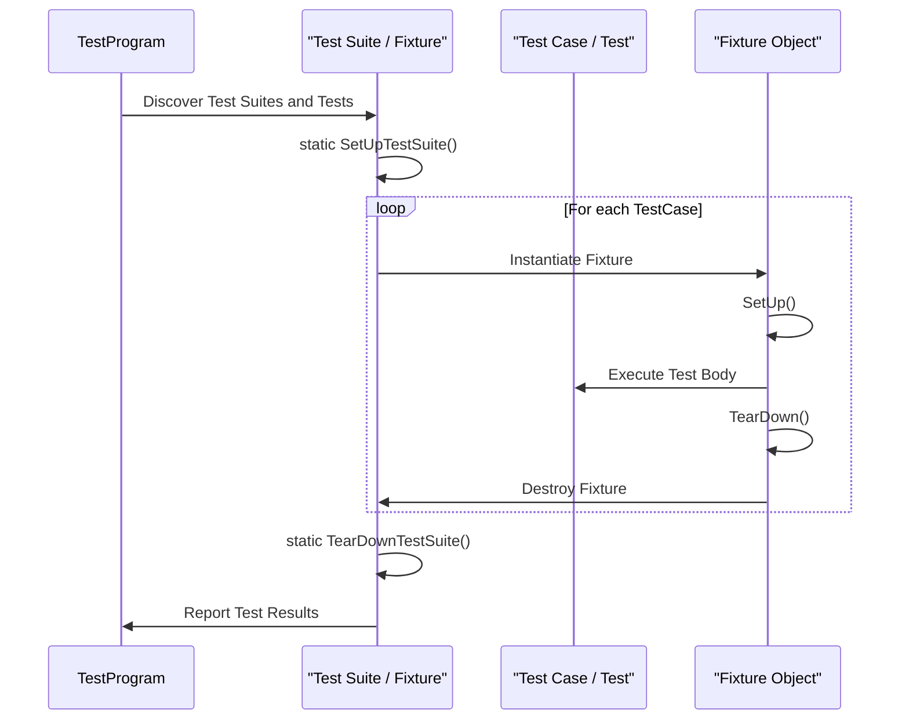

# Test Cases, Suites, and Fixtures

Explore the fundamental abstractions that underpin structured testing in GoogleTest: test cases, test suites, and test fixtures. This guide unpacks how these concepts relate, how they enable code reuse and shared setup, and how they shape the robust testing patterns GoogleTest empowers you to build.

---

## Understanding Test Cases and Test Suites

In GoogleTest terminology, the concept of a **test suite** organizes related tests together, grouping individual **test cases** that share a common context. The earlier usage of the term _test case_ (now deprecated) is effectively replaced by _test suite_, reflecting alignment with the xUnit testing architecture.

- **Test Suite**: A collection of tests logically grouped by name, often representing tests focused on the same class or module.
- **Test Case**: Often used interchangeably with test suite in GoogleTest, it refers to the single test defined within a test suite, identified by a unique test name.

GoogleTest executes each test case individually, even when they belong to the same suite, ensuring isolation and consistency.

### Naming Convention

Test suites and test case names are composed of valid C++ identifiers without underscores. The full name of a test is the concatenation of the test suite and the test case name separated by a dot, such as `FooTest.Bar`.

### Disabled Tests

Prefixing either test suite or test case names with `DISABLED_` disables those tests. Disabled tests are compiled but skipped during execution and clearly marked in test listings.

---

## The Test Fixture: Sharing Setup and State

A **test fixture** is a class that represents a shared context or environment for multiple related tests. It enables common setup and teardown code, as well as data sharing, between tests in the same test suite.

### Defining a Test Fixture

To define a test fixture, create a class deriving from `::testing::Test`. This class can contain:

- **Per-test setup** and **teardown** by overriding `SetUp()` and `TearDown()`, executed before and after each test respectively.
- **Shared setup and teardown** for the entire test suite via static methods `SetUpTestSuite()` and `TearDownTestSuite()`, called once before the first and after the last test in the suite.
- **Shared data** in member variables, static or instance fields.

Example:

```cpp
class FooTest : public ::testing::Test {
 protected:
  static void SetUpTestSuite() {
    shared_resource_ = new Resource;
  }

  static void TearDownTestSuite() {
    delete shared_resource_;
    shared_resource_ = nullptr;
  }

  void SetUp() override {
    // Prepare environment for each test.
  }

  void TearDown() override {
    // Clean up after each test.
  }

  static Resource* shared_resource_; // Shared by all tests in suite
};

Resource* FooTest::shared_resource_ = nullptr;

TEST_F(FooTest, DoesSomething) {
  EXPECT_TRUE(Check(shared_resource_));
}

TEST_F(FooTest, DoesSomethingElse) {
  EXPECT_EQ(shared_resource_->GetCount(), 0);
}
```

### Using TEST_F

The macro `TEST_F(TestFixtureName, TestName)` defines an individual test that uses the test fixture `TestFixtureName`, inheriting its setup and shared data. Each invocation runs as a separate test case within the test suite.


---

## Relationship: How Test Cases, Suites, and Fixtures Work Together

1. **Test suites** group test cases logically.
2. **Test fixtures** represent the setup/data context shared by test cases within the suite.
3. Each **test case** runs independently, creating its own instance of the fixture.
4. The **per-test-suite setup** methods (`SetUpTestSuite` / `TearDownTestSuite`) manage setup/teardown globally for the group.

### Lifecycle Flow:

<Steps>
<Step title="Test Program Startup">
GoogleTest discovers and registers test suites and test cases.
</Step>
<Step title="Before First Test in Suite">
GoogleTest calls `SetUpTestSuite()` for the fixture class.
</Step>
<Step title="For Each Test Case in Suite">
1. Instantiates a new fixture object.
2. Calls the fixture's `SetUp()` method.
3. Executes the test body.
4. Calls the fixture's `TearDown()` method.
5. Destroys the fixture object.
</Step>
<Step title="After Last Test in Suite">
GoogleTest calls `TearDownTestSuite()` for the fixture class.
</Step>
</Steps>

---

## Practical Example

Consider a scenario where you want to test a math library with shared setup:

```cpp
class MathTest : public ::testing::Test {
 protected:
  static void SetUpTestSuite() {
    calculator_ = new Calculator;
  }

  static void TearDownTestSuite() {
    delete calculator_;
    calculator_ = nullptr;
  }

  void SetUp() override {
    calculator_->Reset();
  }

  static Calculator* calculator_;
};

Calculator* MathTest::calculator_ = nullptr;

TEST_F(MathTest, Addition) {
  EXPECT_EQ(calculator_->Add(1, 1), 2);
}

TEST_F(MathTest, Subtraction) {
  EXPECT_EQ(calculator_->Subtract(5, 3), 2);
}
```

Here, `MathTest` serves as the suite having two test cases, `Addition` and `Subtraction`. Both use the same static `calculator_` resource set up once and shared, with reset before each test.

---

## Best Practices

- Use `SetUpTestSuite()` and `TearDownTestSuite()` to initialize expensive resources shared by all tests.
- Avoid tests depending on execution order; GoogleTest runs tests in undefined order.
- Keep per-test state isolated in instance members.
- Use `DISABLED_` prefix cautiously to temporarily disable flaky or under-development tests.
- Use the macro `TEST` for simple tests without fixtures, and `TEST_F` for fixture-based tests.

---

## Troubleshooting Common Pitfalls

- **Mixing TEST and TEST_F in the Same Suite**: GoogleTest enforces that all tests in a suite use the same fixture type. Mixing causes a runtime failure.
- **Forgetting to Initialize Fixture Static Members**: Static members must be defined outside the class.
- **Not Calling RUN_ALL_TESTS in main**: Tests are only executed when `RUN_ALL_TESTS()` is called.
- **Incorrect `SetUpTestSuite` Signature**: Methods must be `static` and spelled correctly.

---

## Relation to Parameterized and Typed Tests

While this page addresses core test abstractions, more complex test scenarios with repeated logic over multiple inputs or types use:

- **Value-Parameterized Tests**: Using `TEST_P` / `INSTANTIATE_TEST_SUITE_P` to run tests over different input values.
- **Typed Tests and Type-Parameterized Tests**: Using `TYPED_TEST` / `TYPED_TEST_SUITE` and related macros for running tests over type lists.

Refer to the [Parameterized and Typed Tests](https://google.github.io/googletest/guide/advanced#value-parameterized-tests) guide for details.

---

## Additional References

- [Testing Reference: Test Declaration & Registration](reference/testing.md#TEST)
- [GoogleTest Primer: Test Fixtures](guides/getting-started/primer-essential-features.md#test-fixtures)
- [Advanced GoogleTest Topics: Global Set-Up & Tear-Down](docs/advanced.md#global-set-up-and-tear-down)
- [Test Event Listeners and Custom Reporting](reference/testing.md#TestEventListener)

---

## Summary
This guide defined core GoogleTest abstractions: test suites as collections of test cases, tests as the executable units, and fixtures as reusable contexts that enable setup and teardown at both per-test and per-suite granularity. Mastery of these concepts provides the foundation to write maintainable, efficient unit tests with clear shared states and robust lifecycle management.

---

## Mermaid Diagram: Test Execution Lifecycle



---

## Tips for Effective Use

- Explicitly manage shared resources using the secure static setup/teardown.
- Leverage fixtures for complex environment setups avoiding duplication.
- Use test suite naming conventions to keep tests organized and filterable.
- Use `SCOPED_TRACE` and custom event listeners to improve test diagnostics.

---

## Troubleshooting

If you encounter test failures due to incompatible mixing of test macros, ensure all tests in a suite derive from the same fixture. For setup issues, confirm static members are defined and setup functions correctly declared as static.

---

# End of Guide
