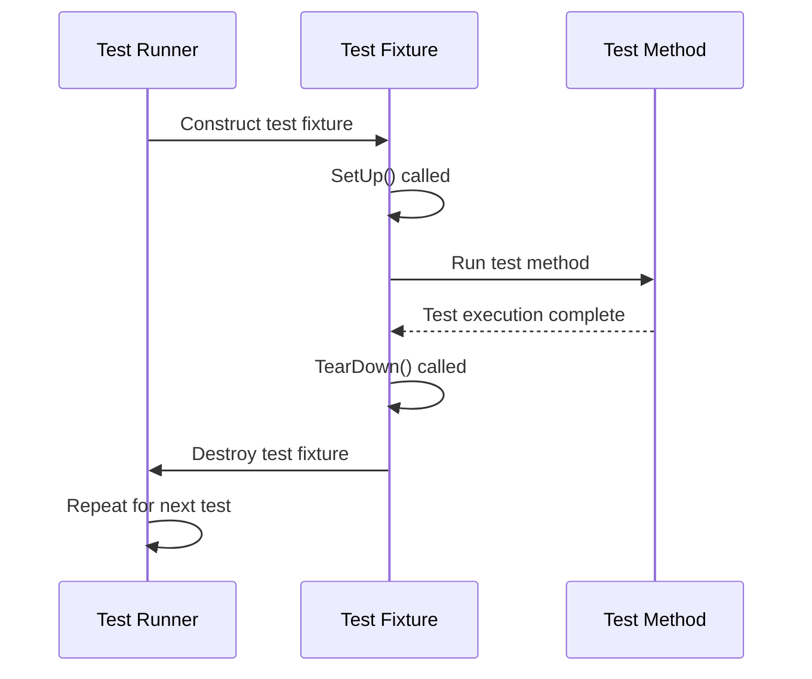

# xUnit Philosophy in GoogleTest

GoogleTest is built upon the widely recognized xUnit testing architecture, a design pattern initially popularized by JUnit for Java and adapted to various languages since. The xUnit model captures fundamental principles to organize, execute, and report tests, ensuring consistent, maintainable, and reliable testing practices.

Understanding how GoogleTest adapts xUnit for C++ is key to leveraging its power effectively. This page walks you through the core ideas of the xUnit philosophy as embodied by GoogleTest: test organization through suites and fixtures, test isolation, and proper lifecycle management via setup and teardown mechanisms. These concepts work together to help you build tests that are easy to understand, extend, and maintain.

## 1. The Core xUnit Model

At its essence, xUnit structures automated tests around a few primary abstractions:

- **Test**: A single unit of verification with a defined behavior and expected outcome.
- **Test Suite (formerly Test Case)**: A collection of related tests, sharing context, purpose, or code under test.
- **Test Fixture**: A pattern to prepare and clean up the common test state before and after each test executes, facilitating reuse and consistency.

GoogleTest adopts and modernizes these abstractions to suit C++'s language features and idioms, embracing the concepts while reflecting current terminology.

### Terminology Clarification

GoogleTest uses these terms with explicit mapping to industry standards:

| Concept                | GoogleTest Term    | Industry (e.g., ISTQB) Term |
|------------------------|-------------------|-----------------------------|
| Unit Test Case         | Test              | Test Case                   |
| Grouping of Tests      | Test Suite (recently replacing Test Case) | Test Suite         |

> **Note:** Historical references within GoogleTest may use *Test Case* to mean what is now called *Test Suite*. New GoogleTest APIs favor the *Test Suite* term.

## 2. Test Organization in GoogleTest

Organizing your tests well is crucial to producing maintainable test code. GoogleTest emphasizes logical grouping to improve clarity and efficiency.

### Test Suites

Test Suites group related tests under a common name representing the feature or component under test. For example:

```cpp
TEST(MathFunctions, FactorialOfZero) {
  EXPECT_EQ(Factorial(0), 1);
}

TEST(MathFunctions, FactorialPositive) {
  EXPECT_EQ(Factorial(5), 120);
}
```

Both tests belong to the **MathFunctions** test suite, highlighting their relation.

### Test Fixtures

When multiple tests require the same setup (such as initializing shared objects), GoogleTest uses *test fixtures* for shared context.

A test fixture is a class derived from `testing::Test` that encapsulates the common test setup and teardown logic.

For example:

```cpp
class DatabaseTest : public ::testing::Test {
 protected:
  void SetUp() override {
    db_.Connect();
  }

  void TearDown() override {
    db_.Disconnect();
  }

  Database db_;
};

TEST_F(DatabaseTest, InsertRecord) {
  EXPECT_TRUE(db_.Insert("record1"));
}

TEST_F(DatabaseTest, RemoveRecord) {
  EXPECT_TRUE(db_.Remove("record1"));
}
```

Here, `TEST_F` identifies tests that use the fixture `DatabaseTest`. Each test runs with a fresh instance of this fixture class, ensuring isolation.

## 3. Isolation of Tests

A central tenet of the xUnit philosophy is test isolation: each test should run independently without side effects from other tests. GoogleTest guarantees isolation by:

- Constructing a fresh test fixture object for every test.
- Calling `SetUp()` immediately after construction to prepare test context.
- Running the test's code body.
- Calling `TearDown()` afterward to clean up.
- Destroying the fixture instance to reset all state.

This robust isolation prevents hidden inter-test dependencies and makes tests reliable and repeatable.

## 4. Lifecycle Methods: Setup and Teardown

The lifecycle management through setup and teardown enables reliable execution of test code. GoogleTest offers multiple levels:

### Per-Test Setup and Teardown

- `SetUp()`: Called before each test to prepare the environment.
- `TearDown()`: Called after each test to clean up.

Use these to initialize data structures, allocate resources, or reset states relevant to the test case.

### Per-Test-Suite (Shared) Setup and Teardown

- `SetUpTestSuite()`: Static method called once before the first test in a test suite.
- `TearDownTestSuite()`: Static method called once after the last test in the test suite.

Employ these for expensive operations that need to happen only once, such as setting up database connections or initializing shared fixtures.

```cpp
class ExpensiveTest : public ::testing::Test {
protected:
  static void SetUpTestSuite() {
    resource_ = new HeavyResource();
  }
  static void TearDownTestSuite() {
    delete resource_;
    resource_ = nullptr;
  }
  static HeavyResource* resource_;
};

HeavyResource* ExpensiveTest::resource_ = nullptr;
```

### Interaction Between Setup Levels

Individual test `SetUp()` and `TearDown()` should focus on preparing per-test conditions and avoid duplicating shared setup.

## 5. Value of the xUnit Model for Users

By aligning GoogleTest with the xUnit philosophy, users gain:

- **Consistency:** Easy recognition of test patterns and naming conventions.
- **Maintainability:** Clear structure via suites and fixtures keeps the code manageable.
- **Reliability:** Guaranteed isolation and lifecycle order prevents flaky tests.
- **Extensibility:** Hooks for shared setup encourage resource-efficient testing.

## 6. Practical Example: Test Lifecycle Flow

Consider this flow when GoogleTest runs your tests:



## 7. Summary and Best Practices

- Always group related tests in **test suites** for clarity.
- Use **test fixtures** (`TEST_F`) when multiple tests share initialization or teardown logic.
- Ensure tests are independent by leveraging the per-test object lifecycle.
- Use `SetUpTestSuite()` and `TearDownTestSuite()` for expensive setup common to all tests in a suite.
- Avoid sharing mutable global state between tests to maintain isolation.
- Follow naming conventions: test suite and test names should avoid underscores to prevent conflicts.

## 8. Troubleshooting Common Misunderstandings

- **Test Fixture Reuse:** GoogleTest creates a fresh fixture per test. Do not expect state changes in one test to carry over.
- **`SetUp()` vs Constructor:** Prefer `SetUp()` for initialization that can fail or require assertions, as constructors do not support fatal assertions.
- **Terminology Confusion:** Understand that in GoogleTest *Test Suites* replace the older *Test Case* term. Each test belongs to one suite.

## 9. Additional Resources

- [GoogleTest Primer](../guides/getting-started/primer-essential-features) - Fundamental usage and basic concepts.
- [Core Test Abstractions](core-test-abstractions) - Deeper dive into test cases, suites, and fixtures.
- [Test Declaration & Registration](../api-reference/gtest-core/test-declaration-registration) - Macros and usage patterns.
- [Test Lifecycle and Discovery](test-lifecycle) - Execution flow and environment.

---

This page focuses on how GoogleTest embodies the xUnit model in C++ for effective testing. By mastering these concepts, you will write tests that are well-structured, isolated, and efficient, harnessing GoogleTest's full capabilities.

---