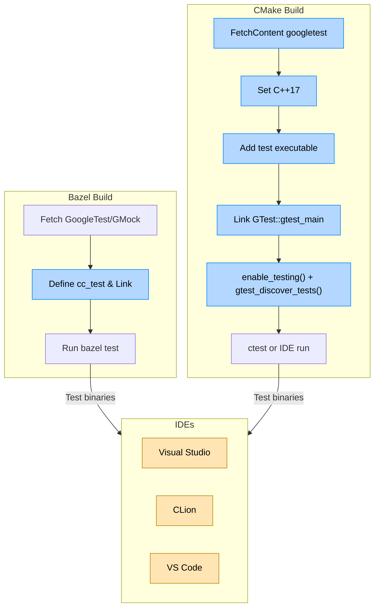

# Integrating with Bazel, CMake, and IDEs

## Overview
This guide walks you through integrating GoogleTest and GoogleMock into your modern build environments and popular IDEs. Whether you use Bazel, CMake, Visual Studio, CLion, or VSCode, this guide offers tailored step-by-step instructions to enable swift onboarding. By following these instructions, your team will achieve a consistent, frictionless testing setup that leverages GoogleTest’s powerful features within your existing toolchains.

---

## Prerequisites
- Have GoogleTest and GoogleMock source code available (either downloaded, git-cloned, or fetched).
- Your development environment supports C++17.
- Familiarity with your build tool and IDE basics.
- For Bazel, knowledge of BUILD files.
- For CMake, version 3.13 or later is recommended.

---

## Bazel Integration
### 1. Add GoogleTest as a Dependency
- Fetch GoogleTest and GoogleMock as external repositories or vendored libraries.
- Use official Bazel BUILD files from GoogleTest repository if possible.

### 2. Define Your Test Targets
- Create a `cc_test` target in your Bazel `BUILD` file referencing `gtest` and `gmock` libraries.

Example:
```python
cc_test(
    name = "my_test",
    srcs = ["my_test.cc"],
    deps = ["@com_google_googletest//:gtest_main", "@com_google_googlemock//:gmock_main"],
)
```

### 3. Running Tests
- Run tests with:
  ```
bazel test //path/to:my_test
```
  
- Tests automatically pick up `gtest_main` to execute `RUN_ALL_TESTS()`.

### Tips
- Use Bazel’s test filtering with `--test_arg=--gtest_filter=FilterPattern`.
- For mock support, link against `gmock` targets as shown above.

---

## CMake Integration
### 1. Declare GoogleTest as Submodule or FetchContent
- Use `FetchContent` to grab a specific commit of GoogleTest for reproducible builds:
```cmake
include(FetchContent)
FetchContent_Declare(
  googletest
  URL https://github.com/google/googletest/archive/03597a01ee50ed33e9dfd640b249b4be3799d395.zip
)
set(gtest_force_shared_crt ON CACHE BOOL "" FORCE) # for Windows runtime compatibility
FetchContent_MakeAvailable(googletest)
```

### 2. Set Up C++ Standard
```cmake
set(CMAKE_CXX_STANDARD 17)
set(CMAKE_CXX_STANDARD_REQUIRED ON)
```

### 3. Add Your Test Executable
```cmake
add_executable(my_test my_test.cc)
target_link_libraries(my_test GTest::gtest_main)
```

### 4. Enable CMake Test Discovery
```cmake
enable_testing()
include(GoogleTest)
gtest_discover_tests(my_test)
```

### 5. Build and Run
```bash
cmake -S . -B build
cmake --build build
cd build
ctest
```

---

## Popular IDE Integrations

### Visual Studio
- Use vcpkg or NuGet packages for GoogleTest to add proper include and library paths.
- Create a `.vcxproj` configuration for tests linked against `gtest.lib` or `gtest_main.lib`.
- Launch tests from the Test Explorer once integrated.

### CLion
- CLion works seamlessly with CMake; follow CMake configuration above.
- Use CLion’s test runner which detects GoogleTest test suites automatically.
- Run or debug tests directly from the IDE interface.

### Visual Studio Code
- Use CMake Tools extension to configure/build GoogleTest projects.
- Use `launch.json` to configure debugger settings for your test executable.
- Use the GoogleTest Adapter extension or `CTest` integration for discovering and running tests.

---

## Best Practices
- Link against `gtest_main` (or `gmock_main` if using mocks) to avoid writing your own `main()`.
- Use C++17 or later in your project for optimal compatibility.
- Keep GoogleTest and GoogleMock versions in sync to avoid ABI issues.
- Disable parallelization in tests with shared mutable state.
- Use `FetchContent` or Bazel external repositories to pin dependencies explicitly.
- Leverage CMake’s `gtest_discover_tests` for automatic test detection.

---

## Troubleshooting
- **Linker errors:** Verify correct linking of `gtest` and `gtest_main`, especially on Windows with CRT linkage.
- **Build failures:** Check compiler supports C++17.
- **Tests not discovered:** Ensure test functions are using `TEST()` or `TEST_F()` macros properly.
- **Mock objects fail linking:** Confirm linking `gmock` libraries.
- **IDE not running tests:** Confirm proper build configuration and test discovery settings.

---

## Summary Diagram of Integration Flow


---

## Next Steps
- Explore the [GoogleTest Primer](primer.md) to begin writing tests.
- Check out [Project Setup & Integration](getting-started/configuration-and-first-test/project-setup) for detailed environment setup.
- Learn about advanced mock setups with GoogleMock from [Mocking Basics](guides/getting-started/mocking-basics).
- For CMake users, see the [Quickstart: Building with CMake](docs/quickstart-cmake.md).
- For Continuous Integration, integrate test runs with Bazel or CMake-based pipelines.

---

<Check>
This guide ensures you can seamlessly add GoogleTest/GoogleMock to your Bazel or CMake build and run your tests directly from popular IDEs, accelerating your development workflow with minimal friction.
</Check>