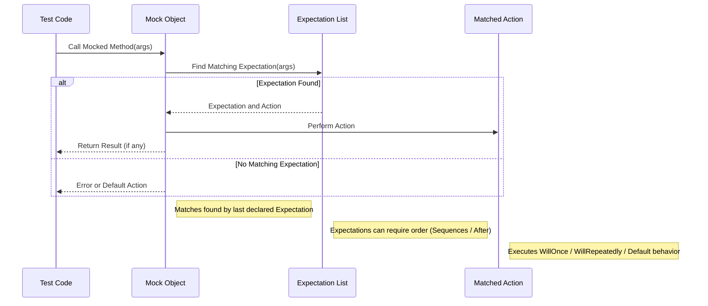

# Mock Behavior and Expectations

This page guides you through the practical process of configuring and verifying mock behaviors in GoogleMock. You will learn how to set expectations on mock objects, specify call orders and counts, and customize mock method responses to write robust, maintainable tests.

---

## 1. Understanding Mock Expectations

When testing with mock objects, the primary objective is to verify that your code interacts with collaborators in the correct way. GoogleMock facilitates this by letting you precisely specify **how** your mocked methods are called and **what** they do.

### What You Will Achieve

- Define expectations for mock method invocations
- Control the number of times functions are expected to be called (cardinality)
- Enforce call order or partial ordering among mock calls
- Tailor method return values and side effects
- Manage expectation lifecycles for complex scenarios

---

## 2. Setting Up Expectations with `EXPECT_CALL`

The core mechanism for specifying mock behavior and verification is the `EXPECT_CALL()` macro.

### Basic Syntax

```cpp
EXPECT_CALL(mock_object, Method(matchers))
    .Times(cardinality)
    .WillOnce(action)
    .WillRepeatedly(action);  
```

- `mock_object` is your mock instance
- `Method` is the mocked method name
- `matchers` specify expected argument values or patterns
- The clause `.Times()` controls how many calls are expected
- `.WillOnce()` and `.WillRepeatedly()` dictate mock behavior when the method is called

### Simple Example

```cpp
using ::testing::Return;
using ::testing::_;  // wildcard matcher

class MockTurtle : public Turtle {
 public:
   MOCK_METHOD(void, PenDown, (), (override));
   MOCK_METHOD(void, Forward, (int distance), (override));
   MOCK_METHOD(int, GetX, (), (const, override));
};

TEST(DrawingTest, MovesForward) {
  MockTurtle turtle;
  EXPECT_CALL(turtle, PenDown()).Times(1);
  EXPECT_CALL(turtle, Forward(10)).Times(1);
  EXPECT_CALL(turtle, GetX()).WillRepeatedly(Return(42));

  Painter p(&turtle);
  p.DrawLine(10);
}
```

> Here, we expect `PenDown()` and `Forward(10)` to be called once. Every call to `GetX()` returns 42.

### Important Notes

- All `EXPECT_CALL()` statements **must appear before** exercising the mock
- By default, if `.Times()` is omitted, GoogleMock infers key cardinalities from actions
- Wildcard matcher `_` can be used to accept any argument value

---

## 3. Controlling Call Cardinalities

You can precisely state how many times a mock method is expected to be called.

### Cardinality Specifiers

| Clause         | Meaning                                        |
|----------------|------------------------------------------------|
| `Exactly(n)`   | Expect exactly `n` calls                        |
| `AnyNumber()`  | Expect any number of calls (including zero)    |
| `AtLeast(n)`   | Expect at least `n` calls                       |
| `AtMost(n)`    | Expect no more than `n` calls                   |
| `Between(m,n)` | Expect between `m` and `n` (inclusive) calls  |

### Examples

```cpp
EXPECT_CALL(foo, Bar(_)).Times(AnyNumber()); // any calls allowed
EXPECT_CALL(foo, Baz(5)).Times(Exactly(2));  // exactly two calls
EXPECT_CALL(foo, Do(7)).Times(AtLeast(1));   // at least once
```

### Default Cardinality Inference Rules

- If no `.Times()` nor any `.WillOnce()` or `.WillRepeatedly()` are specified, `Times(1)` is assumed
- If multiple `.WillOnce()` are specified but no `.WillRepeatedly()`, `Times(n)` where `n` is the number of `.WillOnce()` calls
- If `.WillRepeatedly()` is specified with some `.WillOnce()`, `Times(AtLeast(n))` where `n` is the number of `.WillOnce()` calls

### Disallowing Calls

Setting `.Times(0)` indicates the function must never be called.

```cpp
EXPECT_CALL(foo, Bar(_)).Times(0);  // Fails if called even once
```

---

## 4. Controlling Call Order

When your tests require calls to mocks in a specific order, GoogleMock provides flexible mechanisms.

### Enforcing Strict Sequence with `InSequence`

Wrap expectations within an `InSequence` scope to ensure matched calls follow the specified order.

```cpp
using ::testing::InSequence;

{
  InSequence s;
  EXPECT_CALL(turtle, PenDown());
  EXPECT_CALL(turtle, Forward(100));
  EXPECT_CALL(turtle, PenUp());
}
```

### Partial Ordering with `Sequence` Objects

Use explicit `Sequence` objects to express partial ordering constraints and dependencies between expectations.

```cpp
using ::testing::Sequence;

Sequence s1, s2;

EXPECT_CALL(foo, A()).InSequence(s1);
EXPECT_CALL(bar, B()).InSequence(s1, s2);
EXPECT_CALL(baz, C()).InSequence(s2);
```

This specifies that `foo.A()` must be called before `bar.B()`, which must come before `baz.C()`.

### Ordering Calls with `After` Clause

You can specify that an expectation only matches calls after certain other expectations have finished:

```cpp
Expectation e1 = EXPECT_CALL(foo, Init());
EXPECT_CALL(bar, Run()).After(e1);
```

### Tips

- Avoid over-specifying order unless it is essential for test correctness.
- Use sequences sparingly to keep tests maintainable.

---

## 5. Customizing Mock Behavior with Actions

You can specify what your mock methods do when called, returning values or performing side effects.

### Actions: `WillOnce` and `WillRepeatedly`

- `.WillOnce(action)` specifies what happens on the next call matching an expectation. Multiple `.WillOnce()` clauses can be chained to define a sequence of actions.
- `.WillRepeatedly(action)` defines the action for all subsequent calls after the `.WillOnce()`s.

### Standard Action Examples

```cpp
using ::testing::Return;
using ::testing::_;

EXPECT_CALL(mock, Foo(_))
    .WillOnce(Return(5))         // first call returns 5
    .WillOnce(Return(10))        // second call returns 10
    .WillRepeatedly(Return(0)); // subsequent calls return 0
```

### Using Lambdas and Callables

You can set custom behaviors using lambdas or function objects:

```cpp
EXPECT_CALL(mock, Bar(_))
    .WillRepeatedly([](int x) { return x * 2; });
```

### Combining Actions

`DoAll` lets you combine multiple actions for one invocation:

```cpp
EXPECT_CALL(mock, Update(_))
    .WillOnce(DoAll(SetArgPointee<0>(7), Return(true)));
```

### Common Built-in Actions

- `Return(value)`: returns a copy of `value`
- `ReturnRef(variable)`: returns a reference
- `SetArgPointee<N>(value)`: sets `N`th argument's pointee to `value`
- `Invoke(function_or_lambda)`: calls external function/lambda with arguments
- `DeleteArg<N>()`: deletes pointer argument

For a comprehensive list, refer to the [Actions Reference](reference/actions.md).

---

## 6. Managing Expectation Lifecycles

### Expectations Are Sticky by Default

Expectations remain active even after they are saturated. This means they continue to match calls and may cause failures if called more than the specified count.

Example:

```cpp
EXPECT_CALL(mock, GetValue())
    .WillOnce(Return(1))
    .WillOnce(Return(2));

mock.GetValue(); // returns 1
mock.GetValue(); // returns 2
mock.GetValue(); // fails - expectation saturated but sticky
```

### Retiring Expectations with `.RetiresOnSaturation()`

Add `.RetiresOnSaturation()` to make an expectation stop matching after its expected calls are exhausted.

```cpp
EXPECT_CALL(mock, GetValue())
    .WillOnce(Return(1))
    .WillOnce(Return(2))
    .RetiresOnSaturation();

mock.GetValue(); // 1
mock.GetValue(); // 2
mock.GetValue(); // matches another expectation if any
```

### Expectations Retire Automatically in Sequences

If placed in a sequence, an expectation retires automatically once the next expectation in sequence is used.

---

## 7. Default Behavior Using `ON_CALL`

`ON_CALL()` allows you to specify default behaviors without setting expectations.

- `ON_CALL(mock_object, Method(matchers))` sets default behavior for matching calls
- Default actions **do not set expectations**; calls are allowed but not verified

Example:

```cpp
ON_CALL(mock, GetSize()).WillByDefault(Return(5));
EXPECT_CALL(mock, GetSize()).Times(1);
```

Calls to `GetSize()` will return 5 unless further customized by expectations.

---

## 8. Best Practices and Common Pitfalls

- **Set expectations before exercising mocks** to avoid undefined behavior
- Use `ON_CALL` for default behaviors and `EXPECT_CALL` only when verifying calls
- When specifying multiple expectations on the same method, put more specific cases *after* generic catch-alls
- Use sequences and `.After()` sparingly to avoid overly brittle tests
- Use `.RetiresOnSaturation()` for sequential calls with `WillOnce` to prevent sticky expectation overflows
- When mocking functions returning references, use `ReturnRef()` instead of `Return()`
- Wrap argument types containing commas in extra parentheses or use type aliases with `MOCK_METHOD`
- Avoid verifying mocks multiple times or setting new expectations after verification

---

## 9. Troubleshooting

- **Warning on uninteresting calls**: Use `NiceMock` or add a catch-all `EXPECT_CALL(method, _).Times(AnyNumber())`
- **Expectations not satisfied**: Run tests with `--gmock_verbose=info` to trace mock calls and expectation matches
- **Unexpected calls**: Confirm if argument matchers correctly cover intended calls
- **Excessive calls**: Use `.RetiresOnSaturation()` or adjust `.Times()` declarations
- **Compilation errors with mock methods**: Verify `MOCK_METHOD` usage, especially parameter parentheses for types with commas

---

## 10. Related Resources

- [Mocking Reference](reference/mocking.md) — Full API details for `EXPECT_CALL` and `ON_CALL`
- [gMock for Dummies](gmock_for_dummies.md) — Beginner-friendly guide to mocks
- [gMock Cookbook](gmock_cook_book.md) — Recipes for advanced mocking use cases
- [Matchers Reference](reference/matchers.md) — Built-in and custom matchers for argument validation
- [Actions Reference](reference/actions.md) — Comprehensive list of mock actions
- [GoogleTest Primer](guides/getting-started/primer-essential-features.md) — For understanding test basics

---

## 11. Summary Diagram: Mock Call Expectation Flow



---

<style>
  /* Callout style for tip, note, warning, info, check */
  .callout {
    border-left: 5px solid #007bff;
    background-color: #f8f9fa;
    padding: 0.75em 1em;
    margin: 1em 0;
    border-radius: 0 3px 3px 0;
  }
  .callout.note { border-color: #17a2b8; }
  .callout.warning { border-color: #dc3545; }
  .callout.tip { border-color: #28a745; }
  .callout.info { border-color: #007bff; }
  .callout.check { border-color: #ffc107; }
</style>

<Tip>
Set mock expectations before using the mock, and prefer using `ON_CALL()` for default behaviors to minimize brittle test code.
</Tip>

<Note>
Use `.RetiresOnSaturation()` when chaining multiple `.WillOnce()` to avoid matching saturated expectations inappropriately.
</Note>

<Warning>
Avoid mixing `EXPECT_CALL()` after the mock method has begun to be called; this results in undefined behavior.
</Warning>

<Info>
Control the verbosity of GoogleMock output with the `--gmock_verbose` flag to aid in diagnosing expectation failures.
</Info>

<Check>
Use `NiceMock<T>` to suppress warnings on uninteresting calls and `StrictMock<T>` to treat them as errors.
</Check>

---

