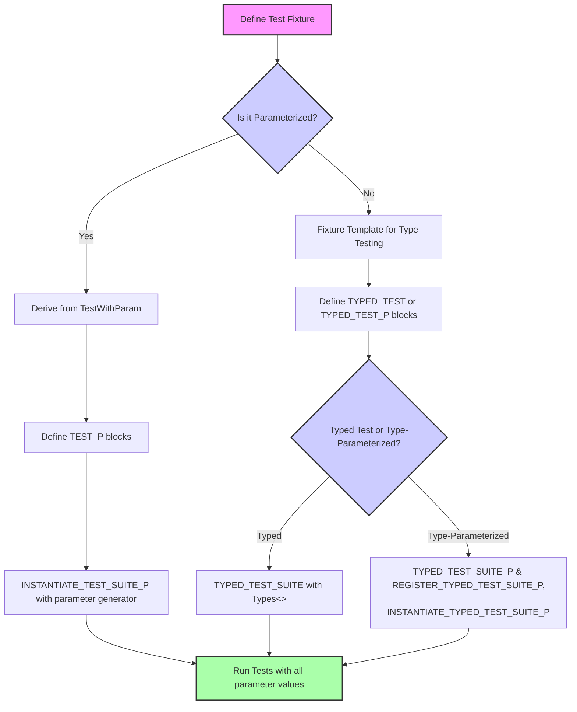

# Parameterized and Typed Tests

GoogleTest provides powerful features to write elegant and maintainable tests that cover multiple scenarios or type variations without duplicating code. This page guides you through leveraging **parameterized and typed tests** to implement DRY (Don't Repeat Yourself) testing patterns efficiently. You will learn how to utilize macros and instantiation patterns to scale your test coverage while keeping your test code clean and manageable.

---

## Overview

### What this guide helps you accomplish

You will learn how to write tests that automatically repeat the same test logic for:

- Different values (parameterized tests)
- Different types (typed tests and type-parameterized tests)

This allows you to test multiple scenarios or variations with minimal boilerplate.

### Prerequisites

- Basic familiarity with writing tests using GoogleTest, including fixtures and assertions.
- Understanding of C++ templates and type lists will help but is not mandatory.

### Expected outcome

By following this guide, you'll be able to:

- Define test fixtures that consume parameters or types.
- Use GoogleTest macros like `TEST_P`, `INSTANTIATE_TEST_SUITE_P`, `TYPED_TEST`, and `TYPED_TEST_SUITE`.
- Create and instantiate both value-parameterized and type-parameterized test suites.
- Customize test name generation for better test identification.
- Understand advanced usage like type-parameterized macros and test registration.

### Time estimate

About 15-30 minutes to read and apply the basic patterns; longer to master advanced techniques.

### Difficulty level

Intermediate

---

## 1. Value-Parameterized Tests (Testing over Data Values)

Value-parameterized tests allow running the same test logic repeatedly with different input values.

### Workflow

<Steps>
<Step title="Define a Parameterized Test Fixture">
Create a fixture class derived from `testing::TestWithParam<T>`, where `T` is the type of parameter you want to test with.

```cpp
class MyParamTest : public testing::TestWithParam<int> {
  // Usual fixture methods
};
```
</Step>
<Step title="Write Parameterized Tests Using TEST_P">
Use `TEST_P` to define your tests that use the parameter value via `GetParam()`.

```cpp
TEST_P(MyParamTest, IsEven) {
  int value = GetParam();
  EXPECT_EQ(0, value % 2);
}
```
</Step>
<Step title="Instantiate the Tests with Parameter Values">
Call `INSTANTIATE_TEST_SUITE_P` to generate tests using your test suite and a parameter generator.

```cpp
INSTANTIATE_TEST_SUITE_P(EvenNumbers, MyParamTest, testing::Values(2, 4, 6, 8));
```
</Step>
<Step title="Run the Tests">
Run your test binary; GoogleTest will execute one test per parameter value.
</Step>
</Steps>

### Parameter Generators Provided by GoogleTest

| Generator           | Description                                               |
|---------------------|-----------------------------------------------------------|
| `Range(begin, end)`  | Generates values from `begin` (inclusive) up to but not including `end`, with optional step size. |
| `Values(v1, ..., vN)`| Specifies explicit list of values.                        |
| `ValuesIn(container)`| Uses values from an STL container or C array.             |
| `Bool()`            | Generates `false` and `true`.                             |
| `Combine(g1, g2, ...)` | Generates Cartesian product of multiple generators.    |

### Custom Test Name Generation

By default, the test names include the parameter index. To customize names for clarity, supply a functor to the last argument of `INSTANTIATE_TEST_SUITE_P`.

```cpp
INSTANTIATE_TEST_SUITE_P(
    CustomNames, MyParamTest, testing::Values(1, 2, 3),
    [](const testing::TestParamInfo<int>& info) {
      return "Value_" + std::to_string(info.param);
    });
```

### Tips and Best Practices

- Declare `SetUpTestSuite()` and `TearDownTestSuite()` as **public** to use with `TEST_P`.
- Use `testing::PrintToStringParamName` for automatic parameter names if possible.
- Combine generators for multi-dimensional parameter testing.
- Use `GTEST_ALLOW_UNINSTANTIATED_PARAMETERIZED_TEST` to avoid failures when a test suite is declared but not instantiated.

### Common Pitfalls

- Defining `TEST_P` without instantiating causes a failing test in `GoogleTestVerification`.
- Test names must be unique and contain only alphanumeric characters or underscore.
- Ensure that parameters passed to generators are copyable.

---

## 2. Typed Tests (Testing Over Types)

Typed tests repeat a test suite for each type in a predefined list.

### Workflow

<Steps>
<Step title="Define a Fixture Template">
Create a fixture class template derived from `testing::Test`.

```cpp
template <typename T>
class MyTypedTest : public testing::Test {
 public:
  T value_;
};
```
</Step>
<Step title="Declare Type List and Associate it with the Suite">
Use `::testing::Types` to list types, then `TYPED_TEST_SUITE` to bind.

```cpp
using MyTypes = ::testing::Types<int, char, double>;
TYPED_TEST_SUITE(MyTypedTest, MyTypes);
```
</Step>
<Step title="Write Typed Tests Using TYPED_TEST">
Use `TYPED_TEST` in place of `TEST_F`. Reference the current type with `TypeParam`.

```cpp
TYPED_TEST(MyTypedTest, IsDefaultConstructible) {
  TypeParam v{};  // Default construct.
  (void)v;
}
```
</Step>
<Step title="Run the Tests">
All typed test cases will run once for each type in `MyTypes`.
</Step>
</Steps>

### Custom Type Names

Use an optional third argument to `TYPED_TEST_SUITE` to provide custom names:

```cpp
class MyTypeNames {
 public:
  template<typename T>
  static std::string GetName(int) {
    if constexpr (std::is_same_v<T, int>) return "Int";
    if constexpr (std::is_same_v<T, char>) return "Char";
    return "Unknown";
  }
};

TYPED_TEST_SUITE(MyTypedTest, MyTypes, MyTypeNames);
```

These names appear in test output instead of the default mangled names.

### Tips

- Use the `typename TestFixture::` prefix to access types defined in the fixture template.
- Use `TestFixture::` to refer to static members inside typed tests.
- Be mindful that each typed test runs independently for each type.

---

## 3. Type-Parameterized Tests (Abstract Type-Parameterized Testing)

Type-parameterized tests generalize typed tests by allowing test suite definitions to be reused with different sets of types across translation units.

### Workflow

<Steps>
<Step title="Define Fixture Template">
Same as typed tests, define a fixture template derived from testing::Test.
</Step>
<Step title="Declare Type-Parameterized Test Suite">
Use `TYPED_TEST_SUITE_P` to declare it.

```cpp
TYPED_TEST_SUITE_P(MyTypeParamTest);
```
</Step>
<Step title="Define Tests with TYPED_TEST_P">
Define tests with `TYPED_TEST_P`. Use the `TypeParam` name for the type parameter.
</Step>
<Step title="Register Tests">
Register your tests with `REGISTER_TYPED_TEST_SUITE_P`.

```cpp
REGISTER_TYPED_TEST_SUITE_P(MyTypeParamTest, Test1, Test2);
```
</Step>
<Step title="Instantiate Tests">
Instantiate the tests with a list of types using `INSTANTIATE_TYPED_TEST_SUITE_P`.

```cpp
using MyTypes = ::testing::Types<int, short>;
INSTANTIATE_TYPED_TEST_SUITE_P(MyInstantiation, MyTypeParamTest, MyTypes);
```
</Step>
</Steps>

### Custom Names

Provide a fourth argument to `INSTANTIATE_TYPED_TEST_SUITE_P` for custom naming similarly to typed tests.

### Benefits

- Allows the test suite definition to be separated from the type list.
- Multiple instantiations can be made in different translation units.

### Notes

- Requires explicit registration of tests before instantiation.
- Macros and template syntax are more complex but provide maximum flexibility.

---

## 4. Practical Examples

### Example: Simple Value-Parameterized Test

```cpp
class IsEvenTest : public testing::TestWithParam<int> {};

TEST_P(IsEvenTest, ReturnsTrueForEvenNumbers) {
  int n = GetParam();
  EXPECT_EQ(0, n % 2);
}

INSTANTIATE_TEST_SUITE_P(EvenNumbers, IsEvenTest, testing::Values(2, 4, 6, 8));
```

### Example: Typed Test Suite

```cpp
template <typename T>
class ContainerTest : public testing::Test {
 public:
  T container_;
};

using ContainerTypes = ::testing::Types<std::vector<int>, std::list<int>>;
TYPED_TEST_SUITE(ContainerTest, ContainerTypes);

TYPED_TEST(ContainerTest, IsInitiallyEmpty) {
  EXPECT_EQ(0U, this->container_.size());
}
```

### Example: Type-Parameterized Test Suite

```cpp
template <typename T>
class NumericTest : public testing::Test {};

TYPED_TEST_SUITE_P(NumericTest);

TYPED_TEST_P(NumericTest, DefaultsToZero) {
  EXPECT_EQ(0, TypeParam{});
}

REGISTER_TYPED_TEST_SUITE_P(NumericTest, DefaultsToZero);

using NumericTypes = ::testing::Types<int, long>;
INSTANTIATE_TYPED_TEST_SUITE_P(My, NumericTest, NumericTypes);
```

---

## 5. Troubleshooting & Tips

- **Tests Not Running?** Verify `INSTANTIATE_TEST_SUITE_P` or `INSTANTIATE_TYPED_TEST_SUITE_P` is called. Missing instantiations disable tests.
- **Names Clashing?** Provide unique instantiation prefixes and/or custom parameter name generators.
- **Static Members Not Accessible?** Use `TestFixture::` or `this->` inside typed test bodies.
- **Compilation Errors in Typed Tests?** Make sure your fixture class templates and macros match syntax exactly.
- **Parameter Type Issues?** Use `ConvertGenerator<T>` when parameter implicit conversion is insufficient.

---

## 6. Next Steps & Related Topics

- Explore [Value-Parameterized Tests](../advanced.md#value-parameterized-tests) for deep dives and use cases.
- Study [Typed Tests](../advanced.md#typed-tests) for type-driven testing.
- Learn [Type-Parameterized Tests](../advanced.md#type-parameterized-tests) for abstraction and extensibility in testing.
- See [Testing Reference — Parameterized and Typed Tests Section](reference/testing.md#parameterized-and-typed-tests) for macro details.
- Visit [Guides — Organizing Tests](guides/core-workflows/organizing-tests.mdx) for test structuring best practices.

---

## Additional Reading

- GoogleTest Primer: [Essential Features](guides/getting-started/primer-essential-features.mdx)
- Testing Reference: [TEST, TEST_F, TEST_P, TYPED_TEST](reference/testing.md)
- Advanced GoogleTest Topics: Detailed typed and parameterized tests section

---

*Use parameterized and typed tests judiciously to keep your tests clean, scalable, and fast to maintain.*

---

## Diagram: Test Instantiation Flow for Parameterized and Typed Tests


