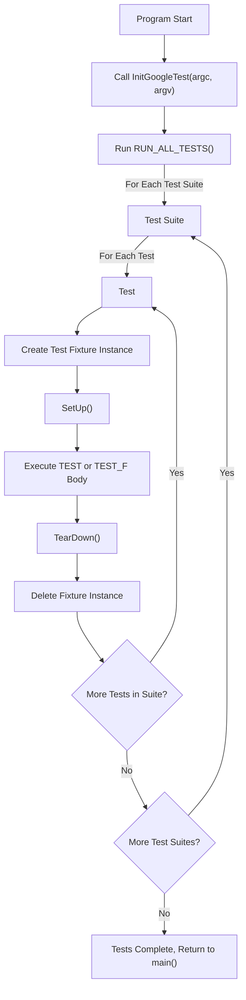

# GoogleTest Primer: Essential Features

## 1. Introduction to GoogleTest Essentials

This guide provides a practical introduction to the fundamental building blocks of GoogleTest. You'll learn how to write and organize tests, use assertions effectively, and leverage test fixtures for better test reuse and clarity. Perfect for users aiming to build a solid foundation before exploring advanced functionalities.

---

## 2. Understanding Tests and Test Suites

### What is a Test?
A *test* in GoogleTest is a function verifying a specific behavior or property of your code. It includes assertions that express what should be true. If all assertions succeed, the test passes; if any assertion fails or the test crashes, the test fails.

### What is a Test Suite?
A *test suite* groups logically related tests. It's named to reflect the component or feature being tested.

### Defining a Simple Test
Use the `TEST` macro to define tests. The first argument is the *test suite* name, and the second is the *test name*, both must be valid C++ identifiers and must not contain underscores.

```cpp
// Tests factorial of 0.
TEST(FactorialTest, HandlesZeroInput) {
  EXPECT_EQ(Factorial(0), 1);
}

// Tests factorial of positive numbers.
TEST(FactorialTest, HandlesPositiveInput) {
  EXPECT_EQ(Factorial(1), 1);
  EXPECT_EQ(Factorial(2), 2);
  EXPECT_EQ(Factorial(3), 6);
  EXPECT_EQ(Factorial(8), 40320);
}
```

Tests within the same suite are grouped together in reports, making related test results easier to interpret.

<Check>
Make sure your test suite and test names do not contain underscores (`_`). This naming convention reduces confusion and prevents conflicts with GoogleTest internal naming.
</Check>

---

## 3. Assertions: Verifying Your Code

Assertions are expressive statements telling GoogleTest what conditions must be true.

### Assertion Types
- `EXPECT_` assertions generate **non-fatal** failures and continue running the current test.
- `ASSERT_` assertions generate **fatal** failures and abort the current test function immediately.

### Example of Using Assertions

```cpp
ASSERT_EQ(x.size(), y.size()) << "Vectors x and y are of unequal length";

for (int i = 0; i < x.size(); ++i) {
  EXPECT_EQ(x[i], y[i]) << "Vectors x and y differ at index " << i;
}
```

Use `ASSERT_*` when continuing after failure doesn't make sense (e.g., dereferencing a pointer). Use `EXPECT_*` otherwise to see all assertion failures at once.

<Note>
You can stream any message to assertions using the `<<` operator to provide context in failure messages.
</Note>

---

## 4. Test Fixtures: Reusing Setup and Data

Tests often require common setup and teardown. GoogleTest provides *test fixtures* to facilitate this.

### Creating a Test Fixture
1. Derive a class from `testing::Test`.
2. Declare shared objects and override `SetUp()` and `TearDown()` if needed.

Example for a `Queue` class:

```cpp
class QueueTest : public testing::Test {
 protected:
  QueueTest() {
    // q0_ empty by default
    q1_.Enqueue(1);
    q2_.Enqueue(2);
    q2_.Enqueue(3);
  }

  Queue<int> q0_;
  Queue<int> q1_;
  Queue<int> q2_;
};
```

### Writing Tests with Fixtures
Use `TEST_F` macro instead of `TEST` to associate tests with fixtures.

```cpp
TEST_F(QueueTest, IsEmptyInitially) {
  EXPECT_EQ(q0_.size(), 0);
}

TEST_F(QueueTest, DequeueWorks) {
  int* n = q0_.Dequeue();
  EXPECT_EQ(n, nullptr);

  n = q1_.Dequeue();
  ASSERT_NE(n, nullptr);
  EXPECT_EQ(*n, 1);
  EXPECT_EQ(q1_.size(), 0);
  delete n;

  n = q2_.Dequeue();
  ASSERT_NE(n, nullptr);
  EXPECT_EQ(*n, 2);
  EXPECT_EQ(q2_.size(), 1);
  delete n;
}
```

Each test uses a fresh instance of the fixture. Changes in one test don't affect others.

---

## 5. Running Tests and Test Programs

GoogleTest automatically registers tests created via `TEST` or `TEST_F`. To run them:

1. Call `testing::InitGoogleTest(&argc, argv)` early in your `main()`.
2. Call `return RUN_ALL_TESTS();` to execute all tests.

### Simple main() Example

```cpp
int main(int argc, char **argv) {
  testing::InitGoogleTest(&argc, argv);
  return RUN_ALL_TESTS();
}
```

This runs all tests, returning `0` if all succeed, and `1` otherwise.

<Warning>
Do not ignore the return value of `RUN_ALL_TESTS()`. It determines the test program's exit code.
</Warning>

---

## 6. Practical Tips and Best Practices

- Organize tests logically into suites reflecting the code structure.
- Use fixtures to share setup/teardown code.
- Prefer `EXPECT_*` assertions where possible to discover multiple failures in a single run.
- Use descriptive failure messages to speed debugging.
- Use the `GTEST_SKIP()` macro to skip tests or test suites at runtime based on dynamic conditions.

---

## 7. Common Pitfalls

- Misnaming test suites or test names with underscores causes compiler errors.
- Mixing `TEST` and `TEST_F` macros incorrectly in the same suite.
- Using `ASSERT_*` in constructors or destructors is invalid.
- Forgetting to call `testing::InitGoogleTest()` before `RUN_ALL_TESTS()`.
- Overlooking that `ASSERT_*` aborts the current function, not the entire test.

---

## 8. Next Steps & Further Reading

- Explore [Value-Parameterized Tests](../advanced.md#value-parameterized-tests) to test with different inputs without code duplication.
- Learn about [Typed and Type-Parameterized Tests](../advanced.md#typed-tests) for testing multiple types uniformly.
- Dive into [Advanced Assertions and Custom Matchers](../guides/core-workflows/advanced-assertions-matchers) for more expressive checks.
- Understand how to set up [Global Test Environments](../advanced.md#global-set-up-and-tear-down) for expensive resources shared across test suites.

---

## 9. Summary Flow Diagram



---

## 10. Full Example Code

```cpp
#include <gtest/gtest.h>

// Simple function to test
int Factorial(int n) {
  return (n <= 1) ? 1 : n * Factorial(n - 1);
}

// Simple test suite with two tests
TEST(FactorialTest, HandlesZeroInput) {
  EXPECT_EQ(Factorial(0), 1);
}

TEST(FactorialTest, HandlesPositiveInput) {
  EXPECT_EQ(Factorial(1), 1);
  EXPECT_EQ(Factorial(2), 2);
  EXPECT_EQ(Factorial(3), 6);
  EXPECT_EQ(Factorial(5), 120);
}

// Test fixture for a Queue class example
class QueueTest : public testing::Test {
 protected:
  QueueTest() {
    q0_.Enqueue(10);
    q0_.Enqueue(20);
  }

  // Assume Queue<int> is a user-defined class
  Queue<int> q0_;
};

TEST_F(QueueTest, Size) {
  EXPECT_EQ(q0_.size(), 2);
}

TEST_F(QueueTest, Dequeue) {
  int* val = q0_.Dequeue();
  ASSERT_NE(val, nullptr);
  EXPECT_EQ(*val, 10);
  delete val;
}

int main(int argc, char** argv) {
  testing::InitGoogleTest(&argc, argv);
  return RUN_ALL_TESTS();
}
```

This simple example covers:
- Defining tests with `TEST` and `TEST_F`.
- Using assertions like `EXPECT_EQ` and `ASSERT_NE`.
- Creating test fixtures for shared state.
- Running tests in `main` with proper initialization.

<Tip>
Always start with the simplest tests to build confidence before moving on to complex scenarios.
</Tip>


---

### Reference
- For detailed macro descriptions and advanced assertions, see [GoogleTest Assertions Reference](reference/assertions.md).
- Explore the [GoogleTest Primer](primer.md) for broader foundational concepts.
- Get more advanced uses at the [Advanced GoogleTest Topics](advanced.md).

