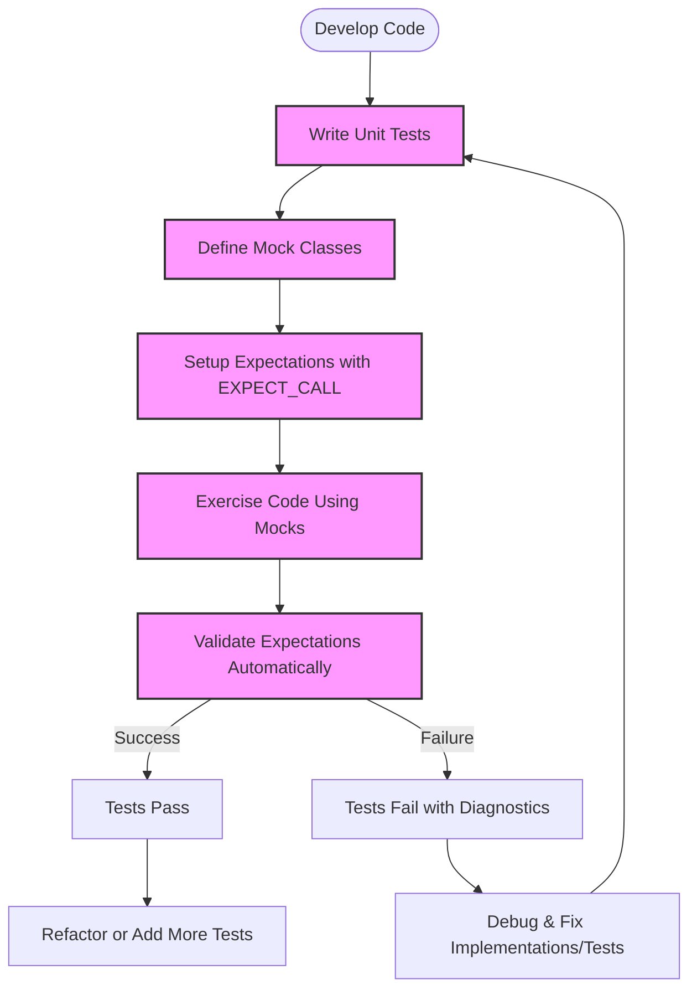

# Common Use Cases & Target Audience

Discover how GoogleTest and its companion mocking framework, gMock, excel in practical development workflows by enabling robust, maintainable, and efficient C++ testing. This guide illustrates common real-world scenarios where GoogleTest fits naturally, helping both framework authors and application developers elevate their testing strategy.

---

## Why GoogleTest Matters in Your Development Process

In modern C++ development, ensuring your code works correctly under diverse conditions is critical. GoogleTest provides a versatile, widely adopted framework that supports writing automated tests with clear expectations, reproducible outcomes, and comprehensive diagnostics.

Whether you're verifying the correctness of a library, validating component contracts, or isolating dependencies via mocks, GoogleTest empowers you to build reliable software confidently.

## Primary Use Cases

### 1. Verifying Library Correctness

Libraries form the backbone of many projects and must maintain consistent, correct behavior across versions. GoogleTest allows developers to write precise, expressive test cases that verify function outputs, state changes, and exception behavior.

**Scenario:** A networking library developer writes unit tests to ensure each function correctly handles valid input, edge cases, and error states. Executing these tests regularly guards against regressions.

### 2. Contract Testing Between Modules

In multi-component systems, modules depend on each other’s interfaces. GoogleTest helps to enforce these contracts by allowing developers to write tests that verify modules interact correctly.

**Scenario:** A storage service uses GoogleTest to validate that its API clients comply with expected request and response semantics, thus preventing integration failures.

### 3. Dependency Isolation through Mocking

Tests should be fast, reliable, and isolated. gMock, bundled with GoogleTest, enables developers to replace real dependencies with mocks that simulate behaviors and verify interactions.

**Scenario:** While testing a payment processing component, a developer uses mock objects to simulate the network layer and database, allowing tests to run quickly without external side effects while asserting the component makes the correct sequence of calls.

### 4. Experimenting with Interface Design and Prototyping

gMock’s ability to rapidly define mocks encourages iterative interfaces design and rapid prototyping, improving software architecture early.

**Scenario:** A team designing a new logging interface uses gMock to prototype various behaviors, allowing them to explore design alternatives without the overhead of implementing complex dependencies.

### 5. Enterprise and Open Source Development

GoogleTest’s open-source nature, broad platform support, and rich feature set make it ideal for both open source projects and corporate environments.

**Scenario:** An enterprise integrates GoogleTest and gMock within its continuous integration pipeline to enforce code quality and verify system correctness before every release.

## Who Benefits Most?

- **Framework Authors**: Build dependable, detailed test suites to maintain framework integrity.
- **Application Developers**: Quickly verify application logic and isolate dependencies.
- **QA Engineers & Test Automation Specialists**: Design precise, reproducible automated tests.
- **DevOps & Integration Teams**: Automate validation of integrations, enabling reliable deployments.
- **Open Source Contributors**: Adopt a standard testing framework for collaborative consistency.

## Before GoogleTest vs. After GoogleTest

| Aspect                     | Before GoogleTest                      | After GoogleTest                        |
|----------------------------|--------------------------------------|---------------------------------------|
| Test Robustness            | Fragile, often manual                 | Automated, reliable with detailed failure reports |
| Dependency Management      | Tests entangled with real dependencies | Mock-based isolation reduces complexity and flakiness |
| Speed                      | Slow due to integration with real systems | Fast, as mocks and fixtures remove external overhead |
| Design Feedback            | Delayed and reactive                  | Early and iterative via mocking and interface prototyping |
| Maintenance                | High effort due to brittle tests     | Lower, thanks to modular and expressive mock expectations |

## Key Benefits and ROI

- **Accelerated Development Cycles**: Faster feedback loops enable rapid iteration.
- **Increased Test Coverage**: Easy mock creation promotes extensive validation.
- **Improved Software Quality**: Interaction verification catches subtle bugs early.
- **Reduced Debugging Time**: Clear error messages lead directly to failing code.
- **Standardized Testing Approach**: Promotes best practices and consistency across teams.

---

## Getting Started Preview

Embarking on GoogleTest’s path begins with integrating the framework (bundled with gMock) into your project. Key prerequisites include:

- C++11 (or newer) compatible compiler
- Build system integration (CMake, Bazel, or manual)
- Basic understanding of unit testing principles

Once set up, you can immediately write tests using simple macros and gradually adopt mocks to isolate and verify interactions. The next step is to explore the [GoogleTest Primer](primer.md) for foundational concepts and the [gMock for Dummies](gmock_for_dummies.md) guide to mastering mocking techniques.

---

## Practical Tips

- Use mocks early to define clear API contracts.
- Avoid over-specifying expectations to keep tests resilient.
- Group related expectations with sequences to enforce call order.
- Employ `NiceMock` and `StrictMock` strategically to control uninteresting call warnings and errors.
- Leverage diagnostic flags like `--gmock_verbose=info` to gain visibility during test failures.

---

## Summary

GoogleTest and gMock provide a comprehensive solution that fits naturally in real-world C++ testing: enabling strong verification of library code, clear interface contracts, and controlled dependency isolation. Its ease of use, rich features, and flexibility benefit a broad audience, from individual developers to large organizations, enhancing testing effectiveness and software quality.

For more details on writing mocks and setting expectations, visit: [gMock for Dummies](gmock_for_dummies.md) and [gMock Cookbook](gmock_cook_book.md).

---

## Related Documentation

- [What is GoogleTest?](what-is-googletest)
- [Core Capabilities: Testing and Mocking](core-capabilities-overview)
- [Mocking Reference](reference/mocking.md)
- [gMock Cookbook](docs/gmock_cook_book.md)
- [Getting Started with GoogleMock](guides/getting-started/mocking-basics)

---

<AccordionGroup title="Core Use Case Illustration - Testing with Mocks">
<Accordion title="Mocking Dependencies to Isolate Behavior">
In a graphics application, instead of testing the actual drawing on screen (which depends on hardware and is fragile), you can create a mock 'Turtle' interface that the application calls. This mock lets you verify if drawing commands like pen down, move forward, and turn are called correctly without rendering.

This approach drastically improves test speed, reliability, and clarity.
</Accordion>
<Accordion title="Contract Testing Between Modules">
Define expectations for function calls between your modules; for example, ensuring your network layer calls the database access component only with valid query parameters, and no forbidden queries. Such contracts can be encoded as mock expectations and verified automatically.
</Accordion>
<Accordion title="Rapid Prototyping and Design Validation">
Use gMock to mock interfaces during initial design phases to validate architectural decisions without full implementations, allowing iterative refinement guided by tests.
</Accordion>
</AccordionGroup>

<Tip>
Starting with default `EXPECT_CALL` declarations combined with `ON_CALL` for default behaviors helps keep tests resilient and easier to evolve.
</Tip>

<Info>
Use sequences (`InSequence`) when the order of calls really matters, such as an API that must be initialized before use.
</Info>

---

## Diagram: Simplified Workflow for Mock-Based Testing

