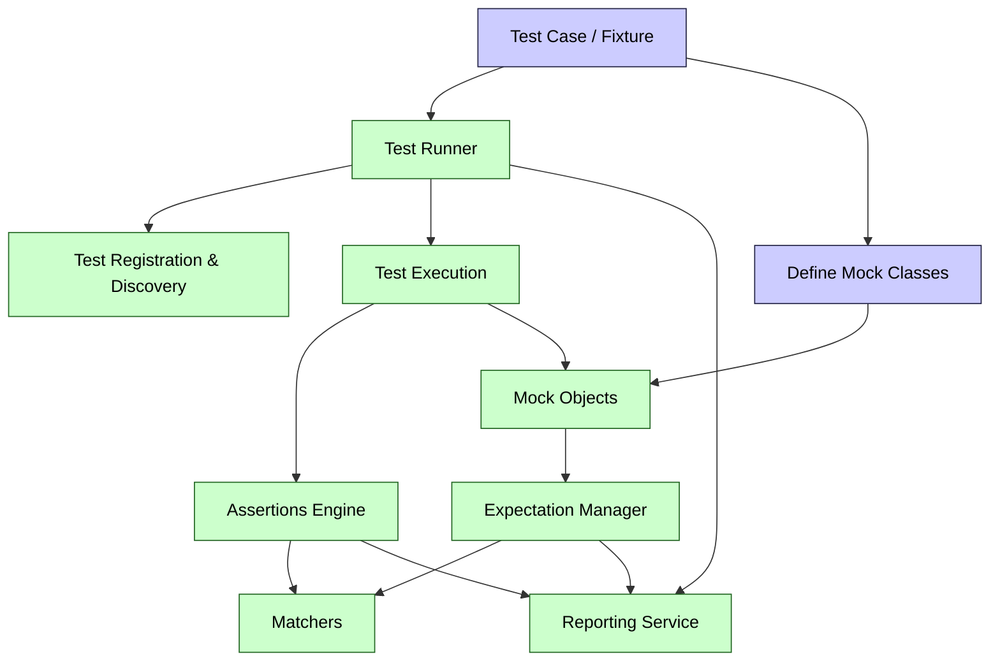

# GoogleTest & GoogleMock Architecture Diagram

## Visualizing the Core Components and Interactions

This page provides a clear and insightful architectural diagram illustrating the main building blocks and data flow within the GoogleTest and GoogleMock frameworks. By visualizing how test cases, test runners, assertions, matchers, and mock objects collaborate, you gain a deeper understanding of how these components work in concert to deliver robust, automated testing and mocking capabilities for C++.

---

### Why This Diagram Matters

When you write tests using GoogleTest and GoogleMock, you want confidence in the framework’s ability to:

- Discover and execute your test cases efficiently.
- Evaluate assertions precisely and report failures clearly.
- Support flexible parameterization and mocking to isolate dependencies.
- Track expectations and interactions with mock objects correctly.

This architecture diagram bridges the gap between using these features and understanding how they fit together internally. It helps you troubleshoot, optimize test design, and appreciate the power and flow underlying the user experience.

---

## Architecture Overview

The diagram captures the major conceptual components involved in the lifecycle of a test in GoogleTest and GoogleMock:

- **Test Cases and Fixtures:** User-defined collections of related test methods sharing setup and teardown semantics.
- **Test Runner:** The engine that discovers registered tests, invokes them, and aggregates results.
- **Assertions Engine:** The subsystem that evaluates conditions within tests and signals pass/fail outcomes.
- **Matchers:** Composable predicates used both in assertions and in mocking to verify argument values.
- **Mocks and Stubs:** Dynamically generated test doubles that intercept calls, verify interactions, and provide fake behaviors.
- **Expectation Manager:** Coordinates the lifecycle of mock expectations, including call verification and ordering constraints.
- **Reporting:** Collects and formats test outcomes, including detailed error reports and stack traces.

### User Interaction Perspective

The diagram shows the user’s point of contact — writing test cases with assertions and defining mocks — then traces the flow as these tests are programmatically discovered and executed by the test runner. It reveals how mocked interfaces intercept calls, how argument matchers validate inputs, and how expectation violations trigger informative failure reports.

---

## Key Components and Their Collaboration

| Component              | Role and Value to Users                                                |
|------------------------|------------------------------------------------------------------------|
| Test Case / Fixture    | Encapsulates a scenario or component to be tested with reusable setup. |
| Test Runner            | Automates finding, running, and managing execution of tests with minimal configuration. |
| Assertions Engine       | Simplifies verifying conditions, allowing users to express expectations clearly. |
| Matchers               | Enables expressive and reusable argument validation in assertions and mocks. |
| Mock Objects           | Provides automated test doubles to isolate dependencies and verify interactions effortlessly. |
| Expectation Manager    | Enforces behavioral contracts on mocks, making tests reliable and intent explicit. |
| Reporting Service      | Presents test outcomes in a user-friendly manner to quickly diagnose pass/fail reasons. |

### Real-World Analogy

Think of building a software test suite like directing a play:

- The **Test Runner** is the stage manager who cues each scene (test case).
- The **Assertions** are the script’s checkpoints to confirm actors (code) say the right lines or do the right things.
- The **Matchers** are the directors’ notes specifying how exact the acting must be.
- The **Mocks** are substitute actors filling in roles for absent stars (real dependencies).
- The **Expectation Manager** ensures actors follow script order and dialogue.
- The **Reporting** is the critic’s review published afterwards.

This diagram shows how all those roles come together.

---

## Mermaid Diagram: GoogleTest and GoogleMock Architecture

---

## How To Use This Diagram

- **For New Users:** See how your test cases will be handled from registration through execution and reporting, with mocks integrated seamlessly.
- **For Test Authors:** Understand the flow to better design your mocks and assertions for maintainability and clarity.
- **For Debugging:** Identify where failures or mismatches may occur — in discovery, assertion matching, mock expectations, or reporting.

---

## Tips and Best Practices Related to the Architecture

- Always define your mocks publicly with `MOCK_METHOD` macros to ensure proper interaction through the framework.
- Use expressive matchers to make your expectations clear, reducing test brittleness.
- Set expectations before exercising the code under test to avoid undefined behavior.
- Use sequences and ordering when testing complex interaction flows to leverage the Expectation Manager’s capabilities.
- Leverage the reporting output from GoogleTest, which will cite the exact location of expectation failures, augmented by the assertion engine.

---

## Troubleshooting Common Issues

- **Test Cases Not Running:** Check registration and discovery - ensure your tests use appropriate macros (`TEST` / `TEST_F`).
- **Mocks Not Behaving as Expected:** Confirm your mocks are set with proper expectations before use, and that argument matchers align with actual calls.
- **Unexpected Assertion Failures:** Review the flow from execution to assertion evaluation; utilize verbose test output for insight.

---

## Next Steps

- Dive into actual code examples in the [GoogleTest Primer](overview/product-intro-core-features/what-is-googletest).
- Explore core features and how to write effective mocks in [Core Capabilities](overview/product-intro-core-features/core-capabilities-overview).
- Learn mocking basics and advanced expectations from the [gMock Cookbook](docs/gmock_cook_book.md) and [gMock for Dummies](docs/gmock_for_dummies.md).

---

For a rich, hands-on experience, begin writing tests and mocks, keeping this architecture as your navigation compass.

<Info>
This diagram visualizes only explicitly mentioned components and their relationships within GoogleTest and GoogleMock based on the provided documentation. It avoids assumptions and focuses on user-relevant architecture.
</Info>
